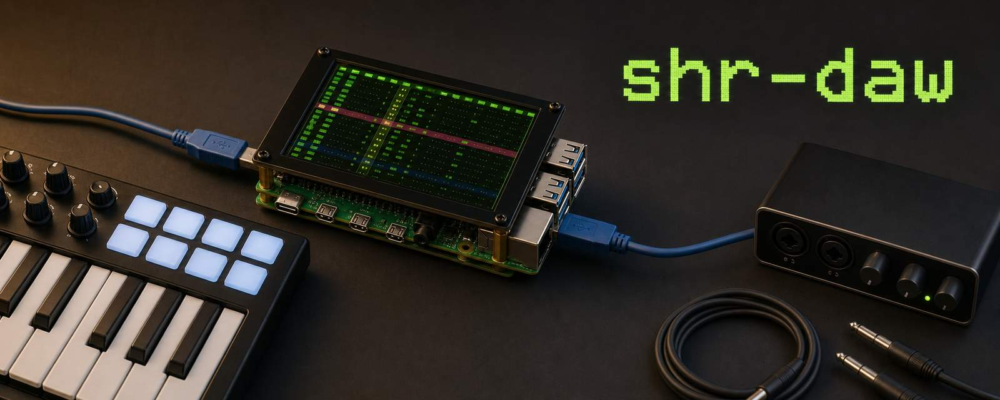
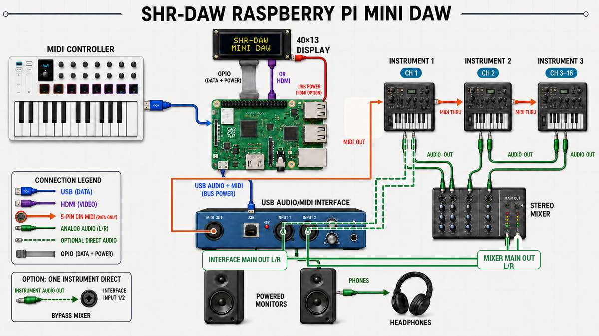
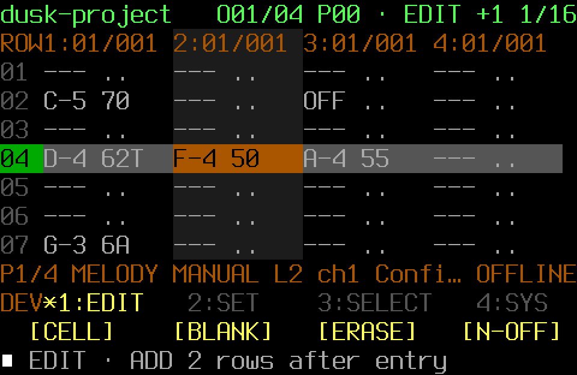

SHR-DAW is a compact Raspberry Pi music workstation written in Rust. It brings
instruments, drums, MIDI sequencing, live performance, loops, effects, mixing,
and recording into a controller-first 40×13 terminal TUI for 64-bit Raspberry
Pi OS Lite. It is meant for turning an idea into a rough demo while travelling
or jamming, without pretending to replace a desktop production DAW.

Read the [complete public documentation](https://paolashultz.github.io/shr-daw/).

> [!WARNING]
> SHR-DAW is alpha software. Not every feature has completed hands-on physical
> testing. It becomes beta after every feature has been tried on real hardware.
> Back up Projects and user data, and begin audio testing at a low monitoring
> level.

Alpha testers are welcome. If anything breaks, feels confusing, or behaves
differently with your equipment, please
[open an issue](https://github.com/PaolaShultz/shr-daw/issues). That feedback
will help get SHR-DAW to beta.

## How it connects



This is an example setup, not a shopping list. Every device is optional, and
hardware names and routes live in configuration rather than the Rust source.
See [Physical connections](docs/CONNECTIONS.md) for the exact paths and safer
ways to start small.

## Features

- Use one installed SHR-DAW sound system with synthv1, Yoshimi, FluidSynth, 13
  editable Moj Sint starts, the cleared SHR Sampler instrument, and four
  bundled SHR Drums kits.
- Play from a controller or keyboard with pickup-protected sound controls,
  scale filtering, held-note/chord feedback, private sound saves, free-timed
  MIDI Ideas, and external-sync controller clock.
- Build FT2-style Patterns and Arrangements with software instruments,
  external MIDI, drums, Pattern-owned loops, note recording/editing, sparse
  automation, a metronome/count-in, and format-1 MIDI export.
- Perform with quantized Live Patterns and a four-slot Loop Mix whose loops
  belong to each Pattern.
- Shape and mix the complete performance through source, aux, drum, and master
  effects, a fixed mastering strip, final-bus meters, and safe source controls.
- Record the final 24-bit stereo performance or synchronized raw mono stems
  with manifests and recovery, including the native 18-channel input overview.
- Configure exact MIDI/audio routes and controller profiles with MIDI Learn,
  startup diagnosis, safe rollback, and owned-process cleanup.
- Navigate every compact workflow with a MIDI controller, MIDI keyboard,
  computer keyboard, or terminal mouse input.

See [Using SHR-DAW](docs/USING_SHR_DAW.md) for the musician workflow,
[Instruments and drums](docs/INSTRUMENTS_AND_DRUMS.md) for the SHR-DAW sound
system, and [How it works](docs/HOW_IT_WORKS.md) for routing, ownership,
storage, and failure boundaries.

## Screenshot tour

### FT2 Pattern editor



### MASTER STRIP


The [screen and menu manual](docs/MENU_MANUAL.md) contains the complete visual
tour.

## Install and run

The clean target is 64-bit Raspberry Pi OS Lite; Patchbox OS and broader
Debian-based systems remain supported. This installs the immutable 0.4.8
release:

```sh
git clone --branch v0.4.8 --depth 1 https://github.com/PaolaShultz/shr-daw.git && cd shr-daw && ./scripts/install.sh
```

After the setup wizard finishes:

```sh
shr doctor
shr
```

JACK is optional for browsing and external-MIDI sequencing. Software
instruments, WAV loops, effects, and audio recording require it. SHR-DAW does
not start or restart JACK. Continue with [First run](docs/FIRST_RUN.md) or the
full [installation guide](docs/INSTALLATION.md).

For a repository-local development checkout:

```sh
cargo build --locked
./scripts/setup-local.sh
./scripts/local.sh
```

The local helpers keep configuration and user data below ignored `user/` and
launch this checkout's visibly marked `DEV` binary.

## Documentation

- [First run](docs/FIRST_RUN.md) and [Using SHR-DAW](docs/USING_SHR_DAW.md)
- [Tracker guide](docs/TRACKER.md), [live performance](docs/LIVE_PERFORMANCE.md),
  and [screen and menu manual](docs/MENU_MANUAL.md)
- [Configuration](docs/CONFIGURATION.md), [physical connections](docs/CONNECTIONS.md),
  and [controller interface](docs/CONTROLLER_INTERFACE.md)
- [How it works](docs/HOW_IT_WORKS.md), [audio graph](docs/AUDIO_GRAPH.md), and
  [multitrack recording](docs/MULTITRACK_RECORDING.md)
- [Complete documentation index](docs/README.md)

## Built with Codex

SHR-DAW is a personal music project developed on its Raspberry Pi target with
Codex CLI as a coding collaborator. The creator owns the musical direction,
hardware, listening decisions, and releases. Generated code is reviewed and
tested; DSP and hardware claims need their own measurements and hands-on checks.
The [development story](docs/BUILD_WEEK.md) records that collaboration.

## Licence

SHR-DAW is MIT licensed. Included presets, demos, rhythms, and WAV loops have
their own clearance boundaries; read [THIRD_PARTY.md](THIRD_PARTY.md) before
packaging or adding sounds.
