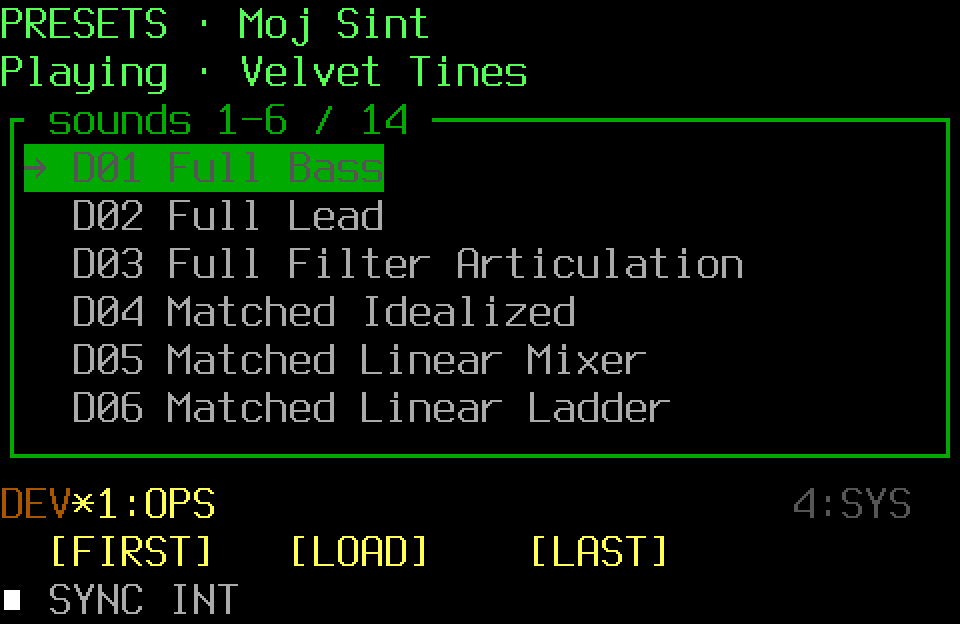
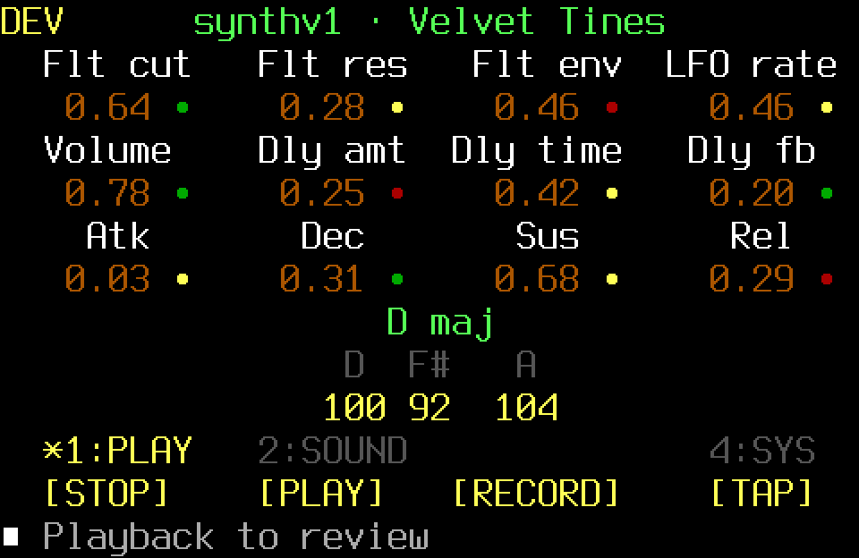
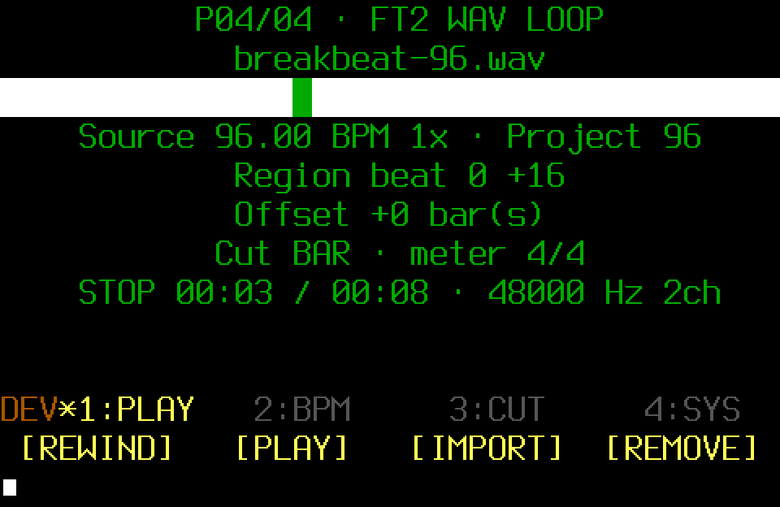
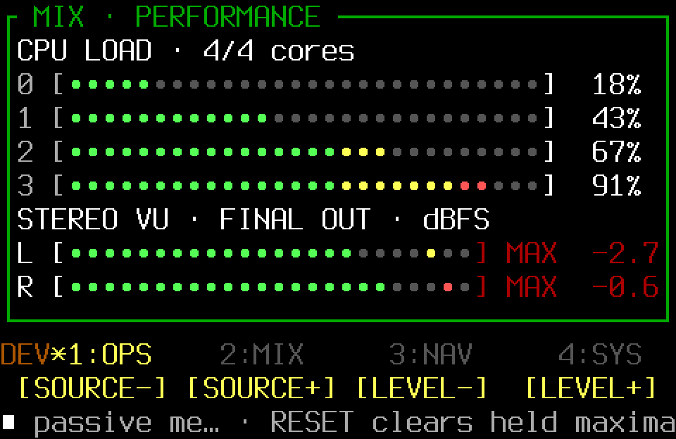

SHR-DAW is a terminal-based Raspberry Pi groovebox and song-sketching
workstation written in Rust. Its main interface is a compact 40×13 TUI for
64-bit Raspberry Pi OS Lite, not a desktop GUI. It is built to turn a musical
idea into a shareable rough sketch, not to replace a desktop production DAW.

It grew from a personal need to play synths and capture ideas quickly while on
the move or jamming with friends. Going from an idea to a shareable sketch in
roughly 10–15 minutes is an intended workflow and design goal, not a benchmark
or guarantee. The useful result is a rough demo or coherent sketch; sharing the
recorded WAV happens outside SHR-DAW.

Read the complete public documentation at
[paolashultz.github.io/shr-daw](https://paolashultz.github.io/shr-daw/).

> [!WARNING]
> SHR-DAW is experimental. Back up Projects and user data, and begin audio
> testing at a low monitoring level.

## Features

- Play synthv1, Yoshimi, FluidSynth, or 13 editable Moj Sint factory starts
  through one managed melodic engine, alongside four bundled kits rendered by
  in-process [SHR Drums](https://github.com/PaolaShultz/shr-drums).
- Capture free-timed MIDI Ideas; build routed software, external-MIDI, drum,
  and loop parts as multi-page Patterns and Arrangements; or perform them with
  Live Patterns and the four-slot Loop Mix.
- Keep loops, routes, 13 bounded effect types, the fixed Reverb-then-Delay
  DRUMS rack, master-strip state, song key, drum kit, and tuning in the Project.
- Record synchronized raw mono stems or a real-time final 24-bit stereo WAV
  after the fixed master strip and protected true-peak path.
- Play and navigate with physical MIDI controls, MIDI keyboards, the computer
  keyboard, or terminal mouse/pointer input.

See [Using SHR-DAW](docs/USING_SHR_DAW.md) for musical workflows and
[How it works](docs/HOW_IT_WORKS.md) for routing, ownership, storage, and
failure boundaries.

## A quick sketch

1. Start or load a Project and choose a software or routed external instrument.
2. Add drums, melodic parts, MIDI Ideas, or Pattern-owned loops.
3. Build Patterns and an Arrangement, or perform through Live Patterns.
4. Shape the sketch with the source, aux, DRUMS, master, and fixed-strip processing.
5. Record the final stereo performance WAV or synchronized raw stems.
6. Share the resulting file outside SHR-DAW with the tools you already use.

## What it is not

- It is not a desktop GUI or a replacement for Ardour, Ableton Live, Reaper,
  Bitwig, or another full-scale production workstation.
- It is not a general plugin host, free-wiring or unlimited-track mixer,
  waveform editor, or full mastering environment.
- It has no offline whole-song renderer, integrated export/upload/sharing
  service, or system for automating every musical decision.

## Install and run

The clean target is 64-bit Raspberry Pi OS Lite. Patchbox OS and the broader
Debian-based path remain supported installation routes:

```sh
./scripts/install.sh
shr-setup
shr doctor
shr
```

The JACK Audio Connection Kit (JACK) is optional for browsing and external-MIDI
sequencing, but required for software-instrument audio, WAV loops, effects, and
audio recording. SHR-DAW does not start or restart JACK. Continue with [First
run](docs/FIRST_RUN.md) or the full [installation guide](docs/INSTALLATION.md),
which keeps clean Lite installation evidence distinct from connected physical
audio/MIDI evidence.

For a repository-local development checkout:

```sh
cargo build --locked
./scripts/setup-local.sh
./scripts/local.sh
```

The local helpers keep configuration and user data below ignored `user/` and
launch this checkout's visibly marked `DEV` binary.

## Screenshot tour

### Software instruments



### Playback



### FT2 Pattern editor


### Live Patterns


### Loop Mix



### Audio recorder


### 18-channel input levels


### Performance bus



### MASTER STRIP


The [screen and menu manual](docs/MENU_MANUAL.md) contains the complete visual
tour without duplicating its controls here.

## Documentation

- [First run](docs/FIRST_RUN.md) and [Using SHR-DAW](docs/USING_SHR_DAW.md)
- [Tracker guide](docs/TRACKER.md) and [screen and menu manual](docs/MENU_MANUAL.md)
- [Live performance](docs/LIVE_PERFORMANCE.md)
- [Configuration and routing](docs/CONFIGURATION.md) and
  [controller interface](docs/CONTROLLER_INTERFACE.md)
- [How it works](docs/HOW_IT_WORKS.md), [audio graph](docs/AUDIO_GRAPH.md), and
  [multitrack recording](docs/MULTITRACK_RECORDING.md)
- [Complete documentation index](docs/README.md)

## Built with Codex

Rust source, focused architecture notes, deterministic tests, and repeatable
builds make SHR-DAW inspectable and modifiable by hand or with coding agents
such as Codex CLI. It has no stable public plugin API, and generated code is not
trusted automatically: DSP changes need deterministic checks and Raspberry Pi
measurement, while hardware routes and audible results need human testing.
Public changes remain subject to maintainer review. The
[development story and dated baseline](docs/BUILD_WEEK.md) records the
project's Codex-assisted work on Raspberry Pi and who made each kind of decision.

## Licence

SHR-DAW is MIT licensed. Included presets, demos, rhythms, and WAV loops have
their own documented clearance boundaries; read [THIRD_PARTY.md](THIRD_PARTY.md)
before packaging or adding sounds.
