# Loops and effects

[Manual home](../MENU_MANUAL.md) · [Everyday screens](EVERYDAY_SCREENS.md) ·
[FT2 and Projects](TRACKER_AND_PROJECTS.md)

WAV loops and the owned effects graph require a running JACK server, but the
screenshots below are deterministic presentation states and never start JACK.
The loop player and graph operate only on resources owned by SHR-DAW.

## FT2 WAV Loop

A Project may attach one privately imported mono or stereo WAV. Import copies
the selected inbox file beneath the user's SHR-DAW data directory. The player
uses native pitch and requires the WAV sample rate to match JACK; it does not
time-stretch or pitch-shift audio to force a fit. The normal screen's stereo
`LOOP OUT` bars show smoothed RMS, a short peak marker, independent session
`MAX` values, and clip state for this WAV alone. They are deterministic preview
values in the screenshots below, not a live JACK measurement.

The meter tap is after the chosen region, interpolation, transport gate, and
edge fades, immediately before the loop player's existing two JACK outputs.
It does not include the synth, source/aux/master effects, recorder input,
hardware gain, or unrelated clients. The separate Performance Meter remains
`FINAL OUT` for the owned graph and still excludes this loop.

### OPS — import and transport

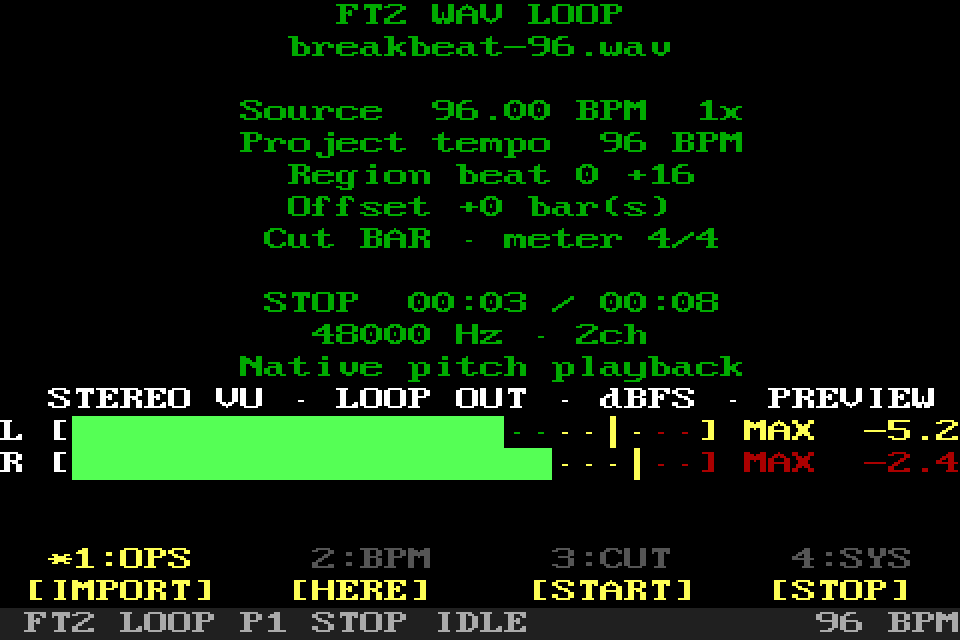

`IMPORT` copies the selected inbox WAV into private storage and attaches it to
the Project. `HERE` plays from the current tracker position. `START` plays from
the Arrangement beginning. `STOP` stops tracker and loop transport.

### BPM — interpret source tempo

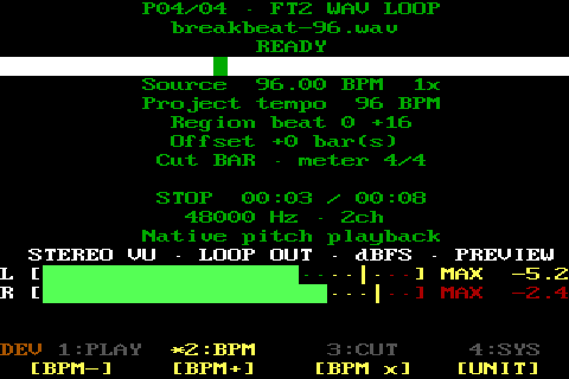

`BPM-` and `BPM+` change the interpreted source tempo. `BPM x` cycles half,
normal, and double interpretation. `UNIT` switches cut adjustment between
single beats and whole bars. Tempo matching changes the current Pattern tempo;
it does not alter the WAV samples.

### CUT — choose the beat region

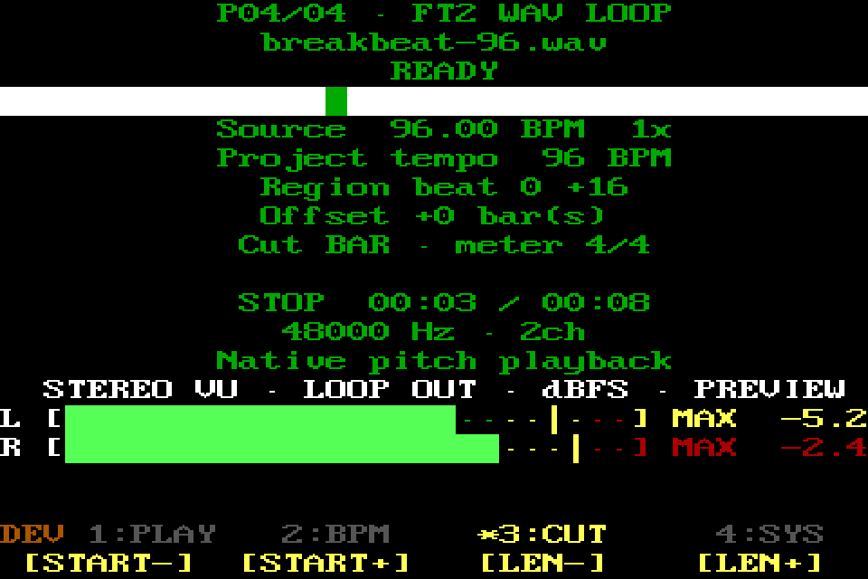

`START-` and `START+` move the region's first beat. `LEN-` and `LEN+` change
its length. The active `UNIT` determines whether each press means one beat or
one whole Project bar.

### SYS — align and return

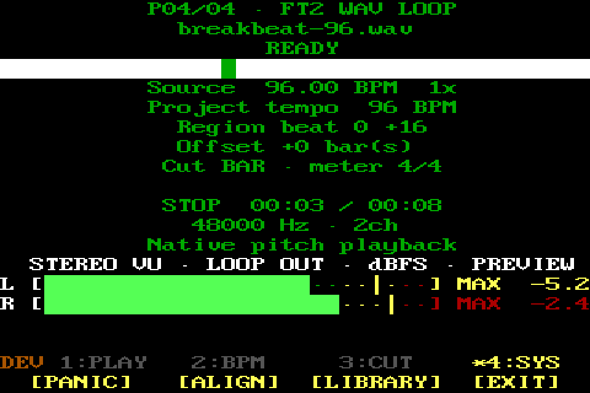

`PANIC` and `STOP` remain reachable. `ALIGN` opens offline analysis and
placement adjustment. `EXIT` returns to FT2 Tools.

## Private loop browser

`LIBRARY` opens the shared overlay over the unchanged loop page. It includes
configured inbox WAVs (`INBOX`), the WAV attached to the current edit
(`CURRENT`), other imported files (`PRIVATE`), and files referenced by saved
Projects (`SAVED`). Turn the rotary to browse and press it to import or attach
and load a file. Press the highlighted `LIBRARY` launcher again, or use Back,
to close the overlay without changing the Project. This is separate from
Project `REMOVE`, which only detaches the current loop.

## Loop Align

Align performs bounded offline pulse/duration analysis, can snap interpreted
length to complete Project bars, and can shift placement without destructively
editing the audio file.

### OPS — analyze and place

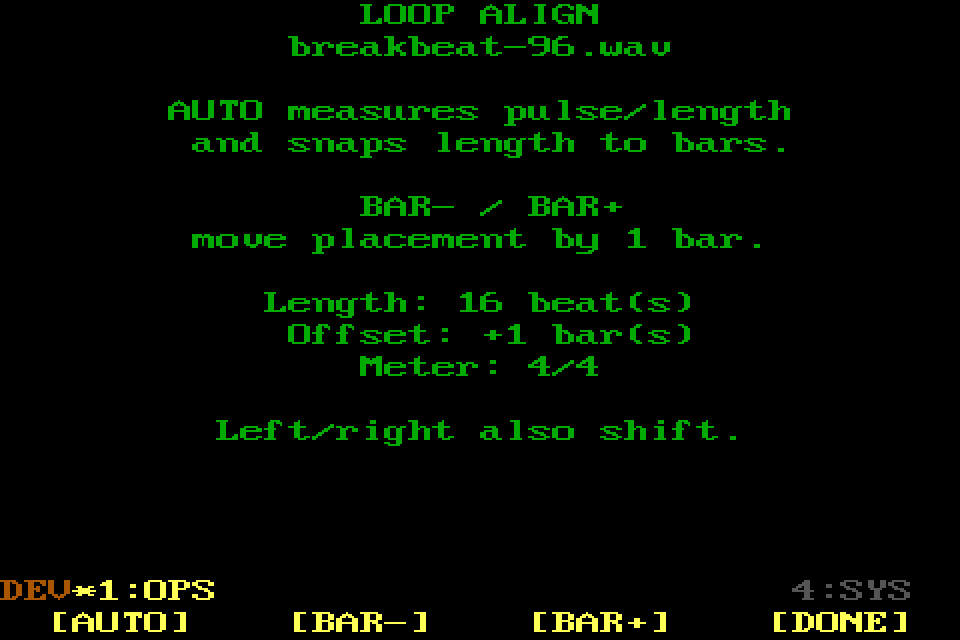

`AUTO` analyzes the attached file and proposes a bar-aligned beat length.
`BAR-` and `BAR+` move its placement by exactly one bar. `DONE` keeps the
settings and returns to WAV Loop.

### SYS — stop or leave

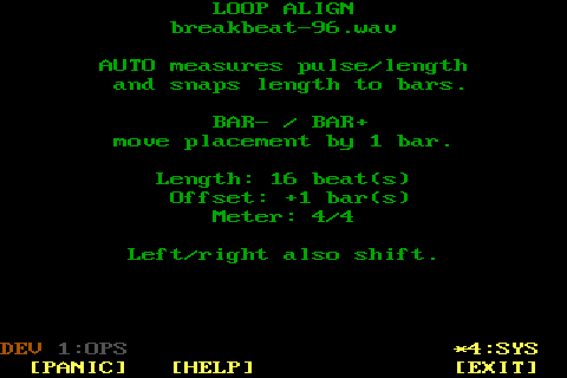

`PANIC`, `STOP`, and `HELP` stay available. `EXIT` returns to WAV Loop without
performing another automatic analysis.

## FX Rack

The rack targets `SOURCE`, `AUX 1`, `AUX 2`, or `MASTER`. Source and master
racks are serial inserts. Aux buses have an independent send level, pre/post
source-insert point, wet-only processor rack, and return level. Each rack is
bounded to eight effects. With the graph active, FX changes are refused while
transport or recording makes publication unsafe. With it disabled, the same
controls edit saved Project data without touching audio.

The screenshot shows a populated source chain. Selecting another target keeps
the same menu but changes the body and which routing actions apply.
The final blank-looking `+ INSERT EFFECT` row is a typed functional selection,
not an effect index or decoration. It remains reachable once, participates in
first/last wrapping, and click/Enter inserts an effect at that position.

### OPS — edit rack contents

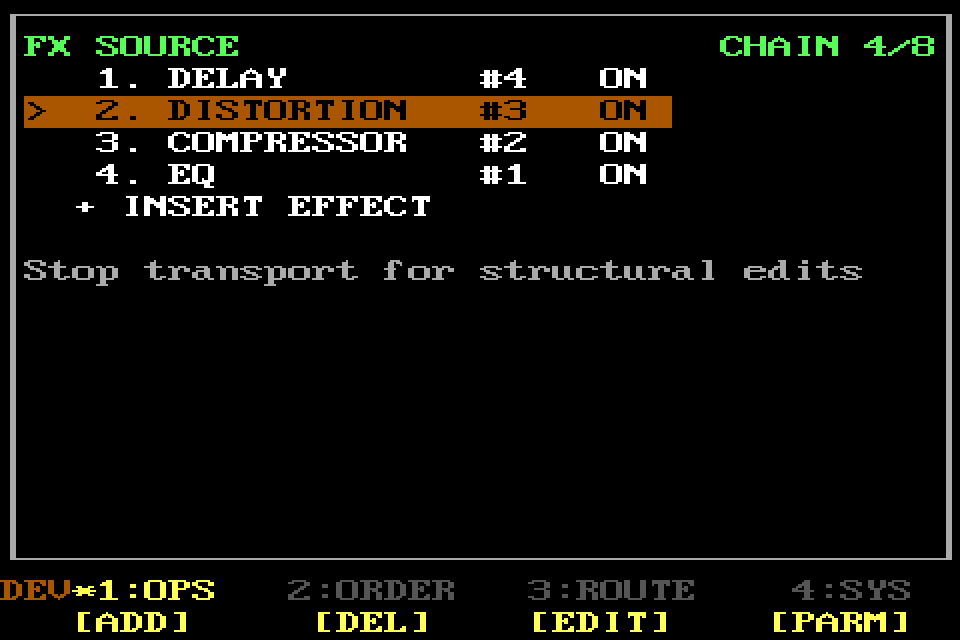

`EDIT` opens the selected processor's named parameters. `ADD` inserts the
currently displayed effect kind at the logical insertion position. `BYPASS`
fades the selected processor between
active and safe bypass. `REMOVE` removes only the selected owned processor.

### ORDER — reorder and choose add kind

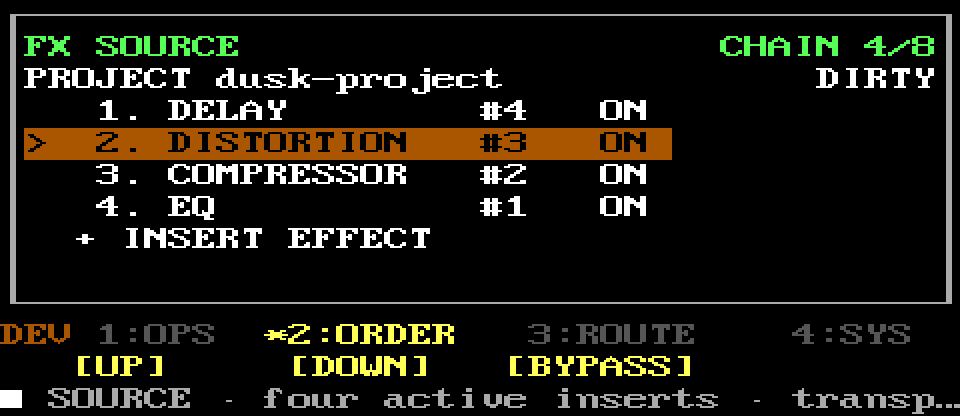

`UP` and `DOWN` move the selected effect within this rack. `KIND-` and `KIND+`
choose the next effect type to add. Aux targets offer only supported wet
time/modulation effects.

### ROUTE — choose rack and aux send

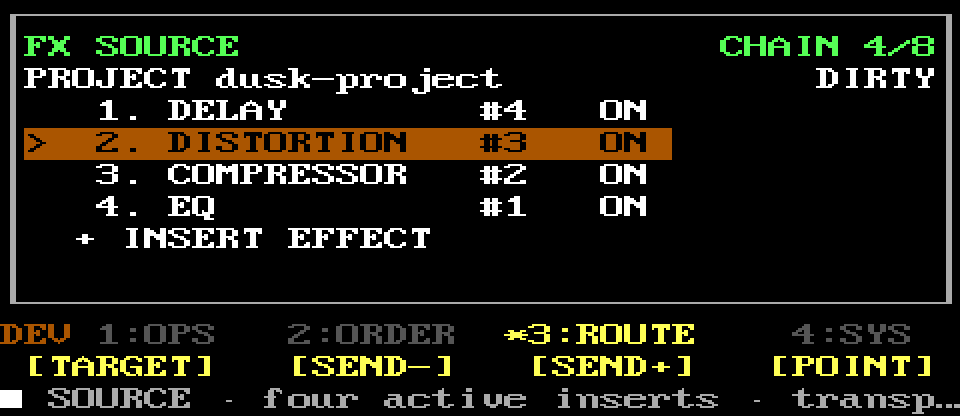

`TARGET` cycles Source, Aux 1, Aux 2, and Master. On an aux target, `SEND-` and
`SEND+` adjust its send level in dB and `POINT` toggles pre/post source inserts.
Those three controls report that an aux must be selected when used elsewhere.

### SYS — return level, help, and exit

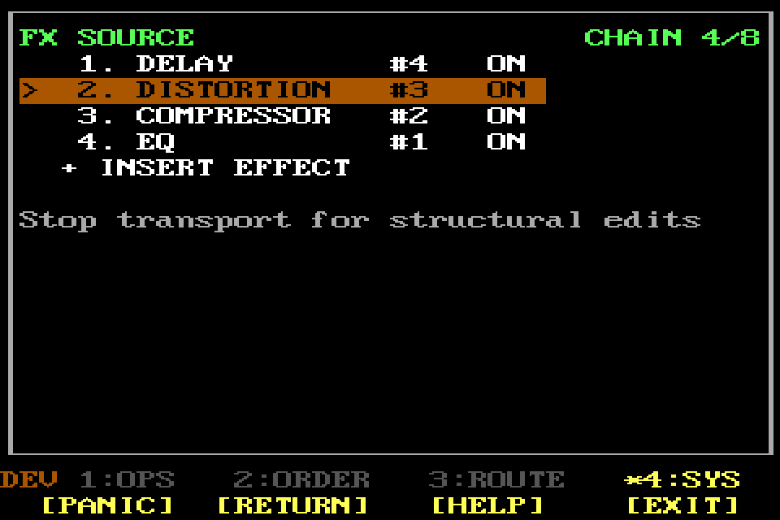

`PANIC` remains available. On an aux target, `RETURN` cycles its independent
return level. `HELP` opens the local reference. `EXIT` returns one level.

## FX parameter editor

Parameters come from strict per-effect schemas. At 40×20 every parameter of
the selected effect—up to the current maximum of 11—stays visible together;
the grid never scrolls. Each row contains only its selection marker, hardware
mapping (`K1`/`F1`), a deliberate stable abbreviation such as `THR`, `RAT`,
`SC-HP`, `FDBK`, or `DECAY`, and a type-aware value/unit. Toggles use ON/OFF,
integers omit decimals, named modes/divisions use compact labels, and dB,
frequency, time, percent, and ratio keep musician-facing units. Persistence
continues to use the full schema names.

The title/state uses one row and metering, when available, is bounded to one
terse `IN / OUT / GR` row. Detailed meter prose never displaces a parameter.
The established screenshot predates this compact pass and is intentionally not
regenerated; deterministic 40×20 buffer tests are authoritative for the new
layout.

### OPS — select and adjust a parameter

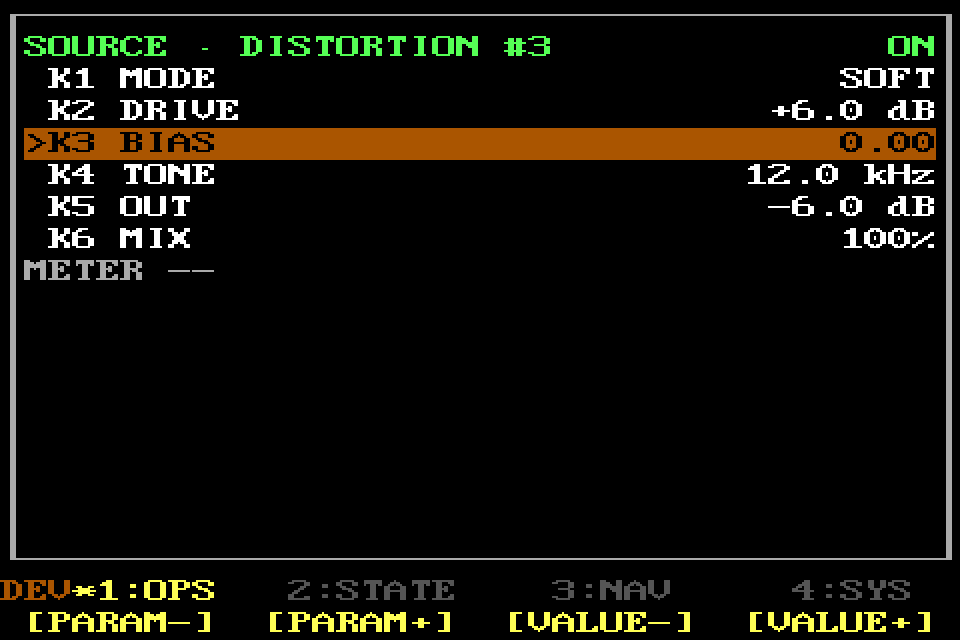

`PARAM-` and `PARAM+` choose a parameter and wrap at both ends. Rotary browsing
does the same; click begins value editing, turn changes only the value, click
confirms, and Back restores the original. `VALUE-` and `VALUE+` use the schema's
safe step and clamp to the validated range. All rows remain visible during
editing and numeric entry.

### STATE — bypass this processor

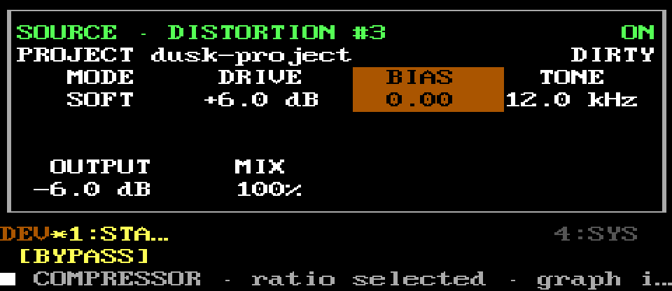

`BYPASS` toggles the edited processor without removing its ID, parameters, or
position. Bypass uses click-conscious smoothing in the active graph.

### NAV — return to the rack

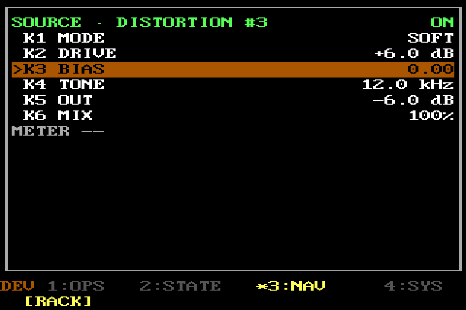

`RACK` returns to the parent rack while keeping valid parameter changes.

### SYS — safety and exit

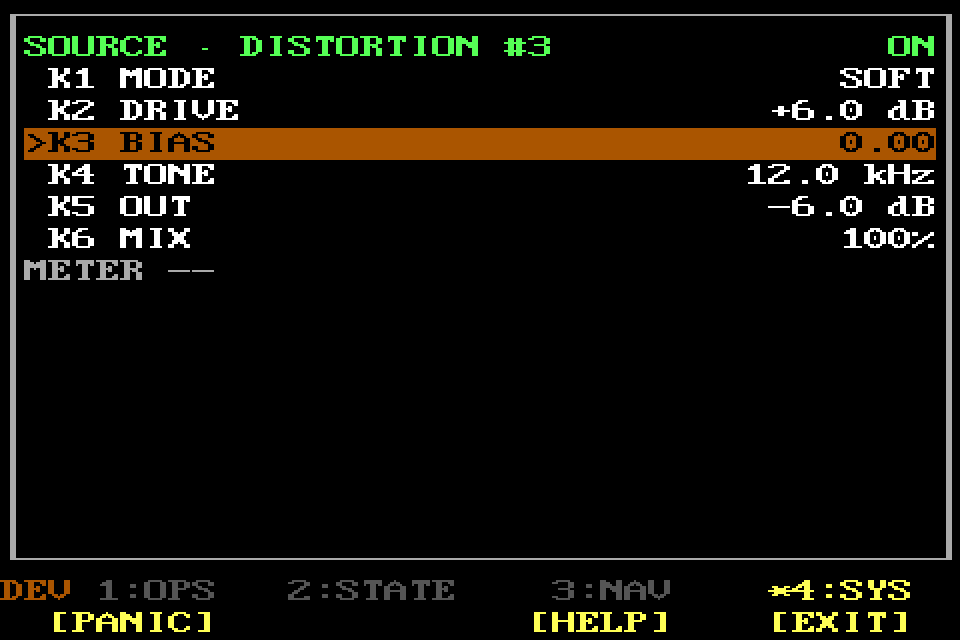

`PANIC` and `HELP` stay available. `EXIT` returns to the rack. Invalid or
non-finite parameter values are refused rather than published to audio.
