# Loops and effects

[Manual home](../MENU_MANUAL.md) · [Everyday screens](EVERYDAY_SCREENS.md) ·
[FT2 and Projects](TRACKER_AND_PROJECTS.md)

WAV loops and the owned effects graph require a running JACK server, but the
screenshots below are deterministic presentation states and never start JACK.
The loop player and graph operate only on resources owned by SHR-DAW.

## FT2 Loop Mix

Every FT2 Pattern owns four optional references to privately imported mono or
stereo WAVs. The page shows the Pattern under the FT2 cursor; browsing does not
change the sounding Pattern. Every active
slot must match its Pattern tempo and JACK sample rate; playback stays native
pitch/speed with no time-stretching. The four fixed renderers sum inside one
owned Loop JACK client, so the existing `LOOP OUT` meter and final bus receive
the complete Loop source once.

Selection is white and never launches. Rows separately show playing, stopped,
queued launch/stop, muted, missing, and faulted slots. One bad WAV does not stop
the other three. The ordinary rotary browses inbox WAVs; Shift-rotary changes
the selected slot through the same wrapping action as `SLOT-`/`SLOT+`.

These ownership and state shots use the same real renderer without starting
audio:

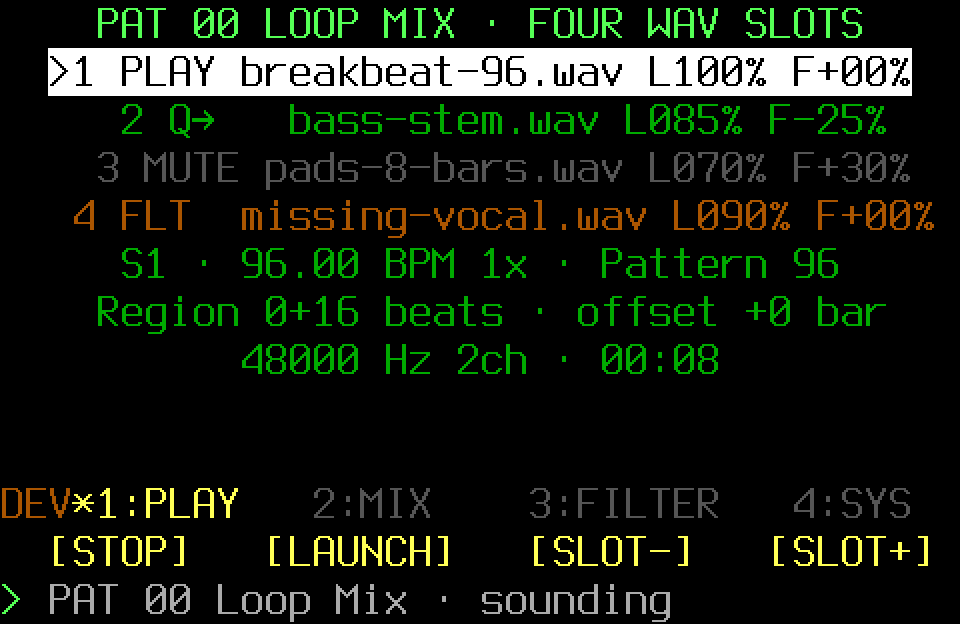

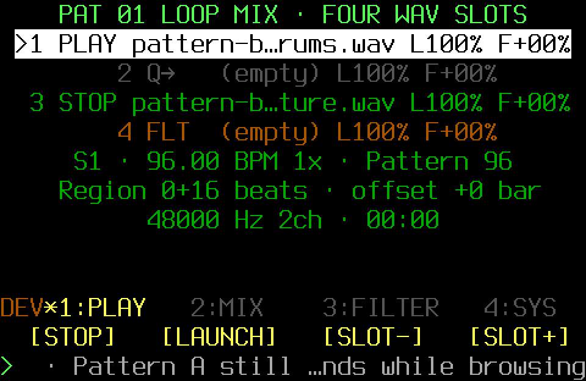

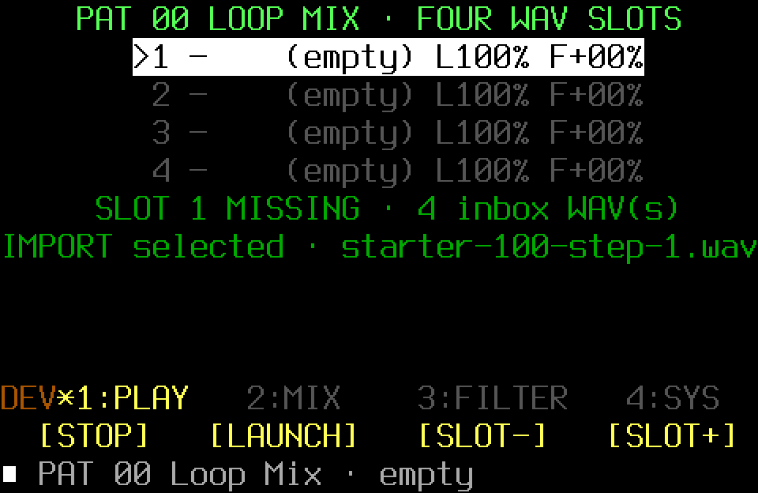

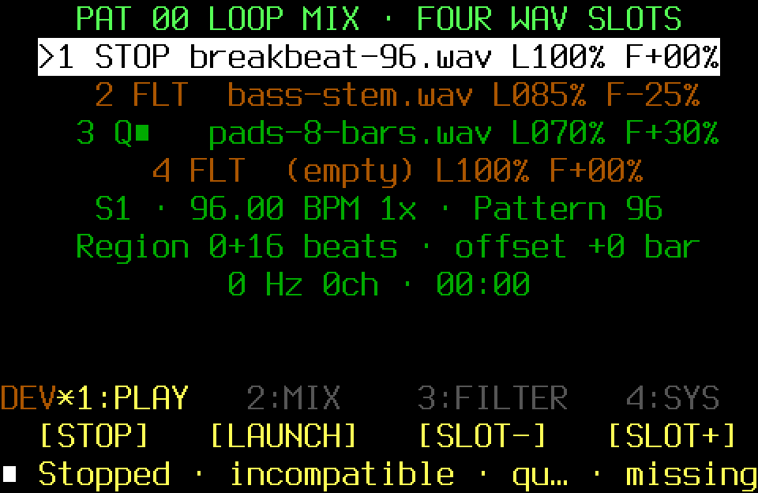

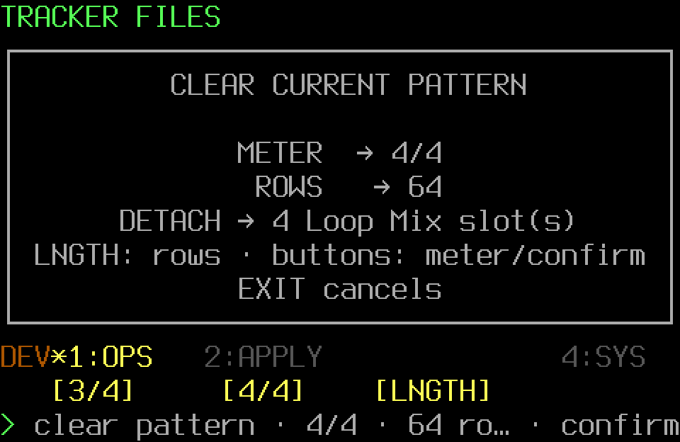

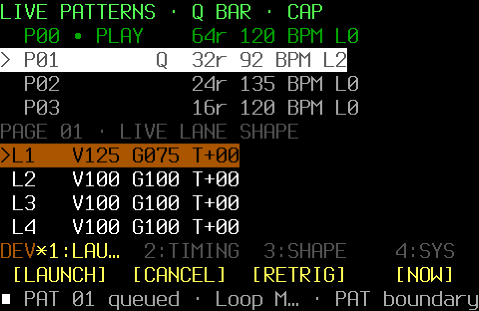

The root Loop Mix tour is the native 40×13 view; smaller terminals fall back
without taking the shared status row:

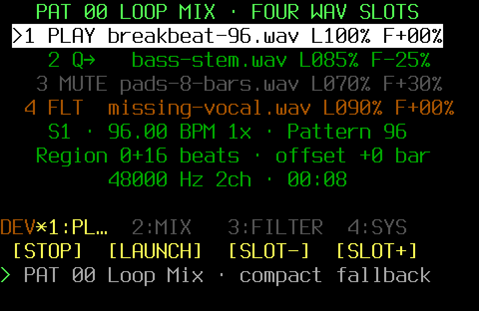

### PLAY — bar-quantized slot transport

`STOP` and `LAUNCH` queue the selected slot for the next Pattern-local bar.
`SLOT-`/`SLOT+` change selection without playback. A later command replaces
the earlier queue.

### MIX — level, mute, and remove

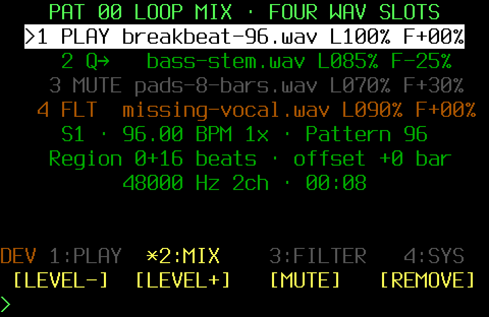

`LEVEL-`/`LEVEL+` adjust the selected slot's smoothed 0–150% level. `MUTE`
affects only that slot. `REMOVE` requires confirmation, clears only its Pattern
reference, and keeps the private WAV.

### FILTER — bipolar shaping and queue cancel

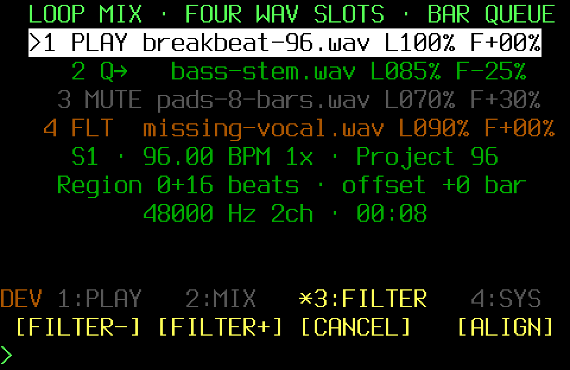

`FILTER-` moves from neutral toward low-pass; `FILTER+` moves toward high-pass.
The centre deadband is neutral and changes are smoothed. `CANCEL` removes the
selected slot's queued command. `ALIGN` opens bounded offline analysis and
whole-bar placement.

### SYS — safety, import, library, and return

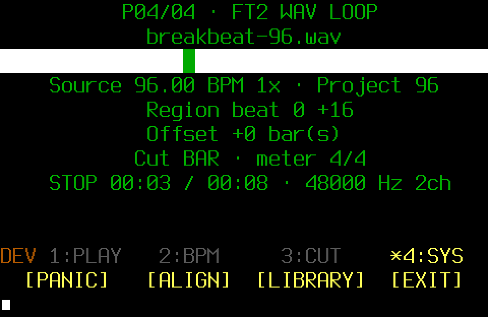

`PANIC` remains reachable. `IMPORT` attaches the selected inbox WAV to the
selected slot. `LIBRARY` opens the shared loop browser for that slot. `EXIT`
returns to the caller without moving its cursor.

## Private loop browser

`LIBRARY` opens the shared overlay over the unchanged loop page. It includes
`INBOX`, `CURRENT`, `PRIVATE`, and `SAVED` entries. Turning the rotary changes
selection silently. Controller `PLAY` at position 6 explicitly previews the
selection; pressing it again stops. Changing selection, controller `STOP`,
Back, the highlighted `LIBRARY` launcher, or leaving the browser stops the
preview. Pressing the rotary/Enter commits the selected file: `INBOX` imports
first, while the other types attach an existing private WAV. A failed preview
or import leaves the browser selection and caller state in place for retry, and
a failed import removes its private copy. The browser has no deletion action.

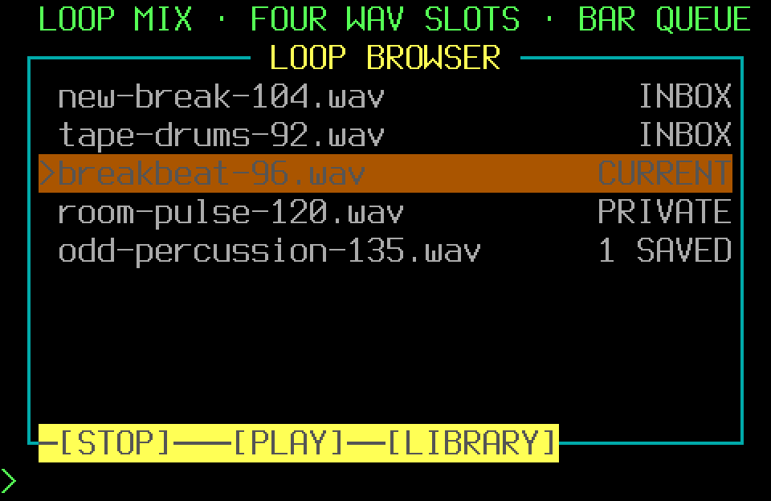

The caller remains visible while the overlay identifies each file's source and
saved-Pattern relationship.

## Loop Align

Align performs bounded offline pulse/duration analysis, can snap interpreted
length to complete Pattern bars, and can shift placement without destructively
editing the audio file.

### OPS — analyze and place

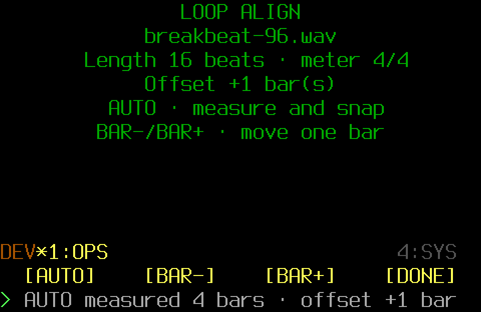

`AUTO` analyzes the attached file and proposes a Pattern-bar-aligned beat length.
`BAR-` and `BAR+` move its placement by exactly one bar. `DONE` keeps the
settings and returns to WAV Loop.

### SYS — safety, help, and leave

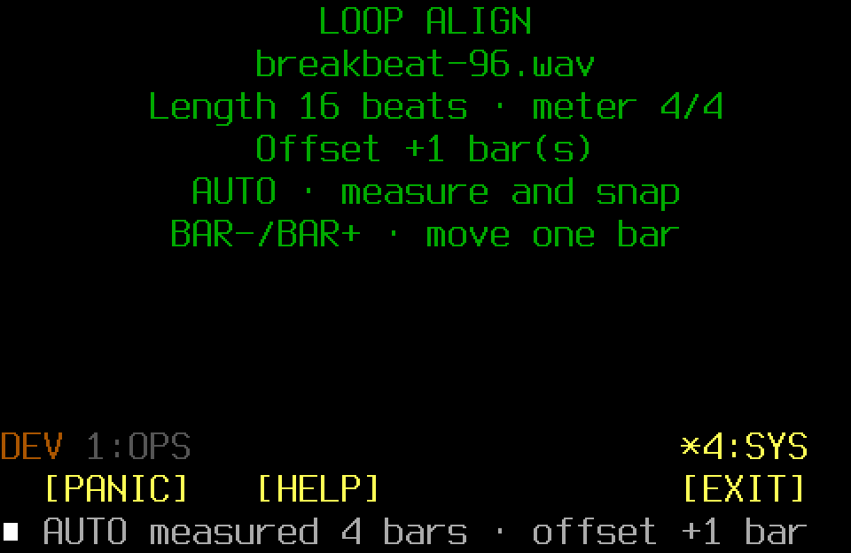

`PANIC` and `HELP` stay available. `EXIT` returns to Loop Mix without
performing another automatic analysis.

## FX Rack

The rack targets `SOURCE`, `AUX 1`, `AUX 2`, `AUX 3`, `DRUMS`, or `MASTER`. Source,
drum, and master racks are serial inserts. Aux buses have an independent send
level, pre/post source-insert point, wet-only processor rack, and return level.
Each rack is bounded to eight effects. The ordinary rotary browses its rows;
Shift-rotary selects the previous or next target in the existing order. With
the graph active, FX changes are refused while transport or recording makes
publication unsafe. With it disabled, the same controls edit saved Project
data without touching audio.

The first screenshot shows a populated source chain. Selecting another target
keeps the same menu but changes the body and which routing actions apply.
The final blank-looking `+ INSERT EFFECT` row is a typed functional selection,
not an effect index or decoration. It remains reachable once, participates in
first/last wrapping, and click/Enter inserts an effect at that position.

### OPS — edit rack contents

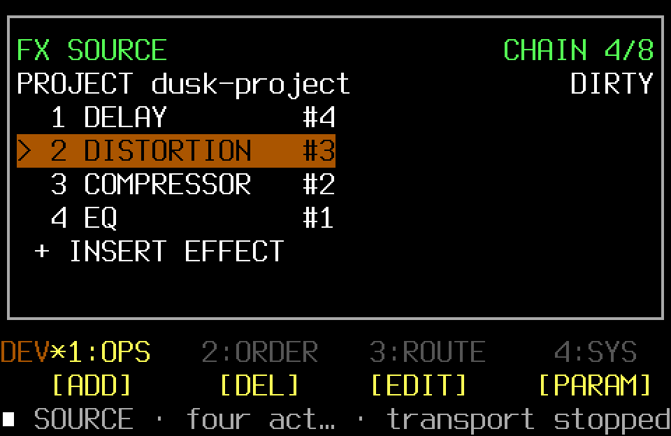

`ADD` inserts a provisional processor and opens its Type context. `DEL` removes
only the selected owned processor. `EDIT` opens the Type context for the
selected processor. `PARAM` opens its named parameter editor.

### ORDER — reorder, bypass, or open the fixed strip

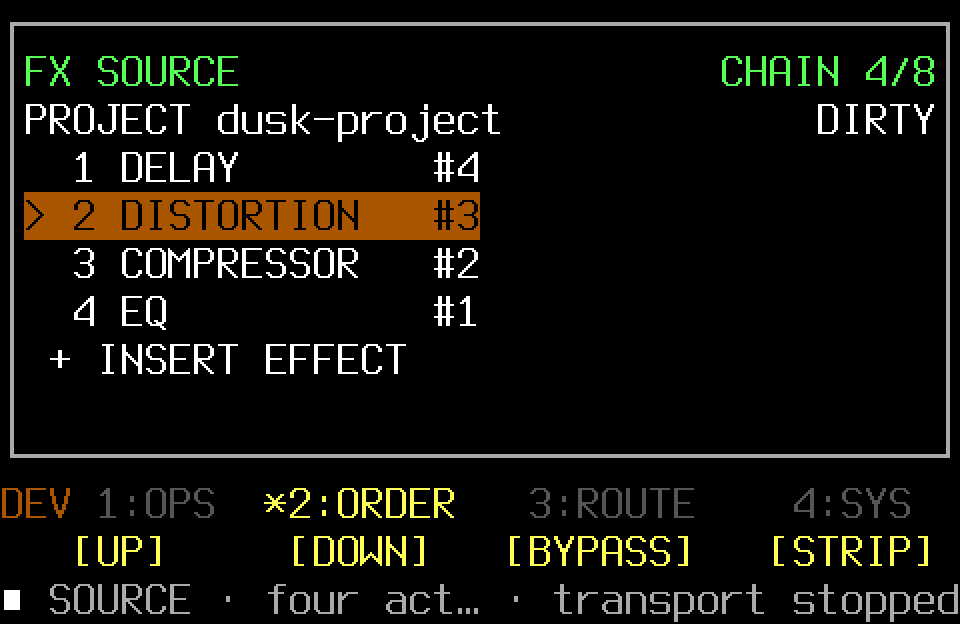

`UP` and `DOWN` move the selected effect within this rack. `BYPASS` fades it
between active and safe bypass. Aux targets offer only supported wet
time/modulation effects. On the MASTER target, `STRIP` opens the fixed
Project-global mastering path after this reorderable rack.

### ROUTE — choose rack and aux send

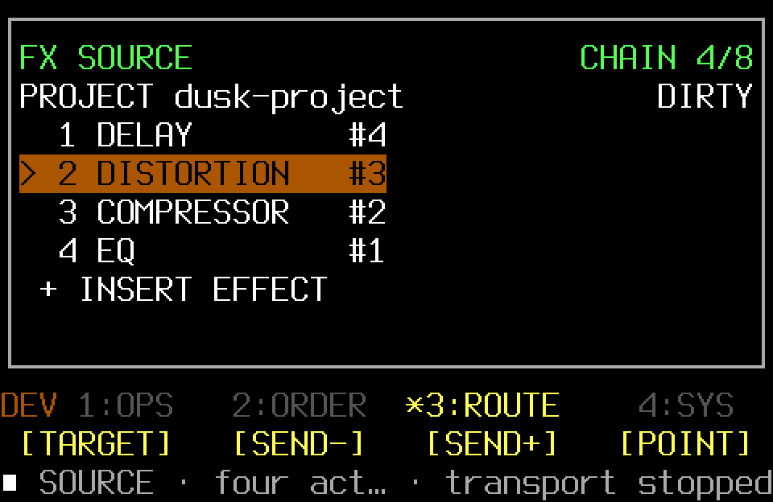

`TARGET` cycles Source, Aux 1, Aux 2, Drums, and Master forward. Shift-rotary
uses that same order in either direction. On an aux target, `SEND-` and `SEND+`
adjust its send level in dB and `POINT` toggles pre/post source inserts. Those
three controls report that an aux must be selected when used elsewhere.

### SYS — return level, help, and exit

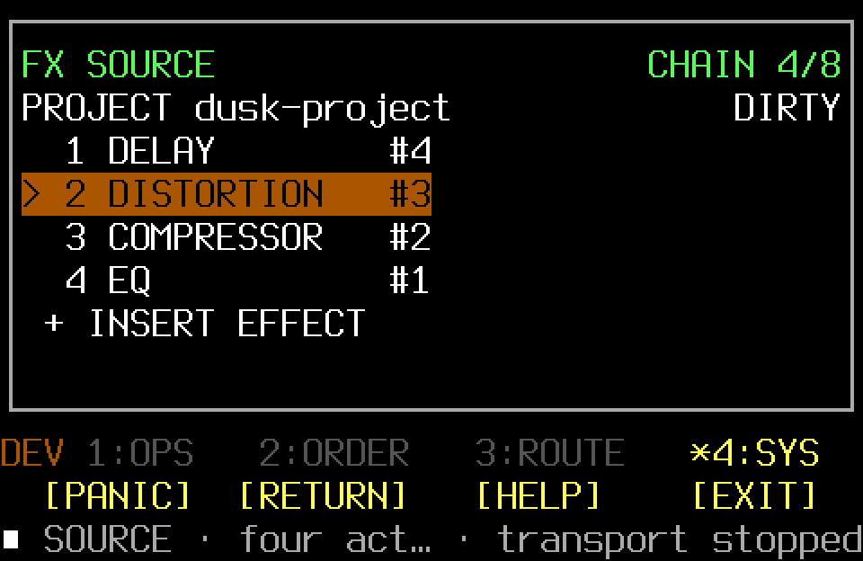

`PANIC` remains available. On an aux target, `RETURN` cycles its independent
return level. `HELP` opens the local reference. `EXIT` returns one level.

### Empty rack context

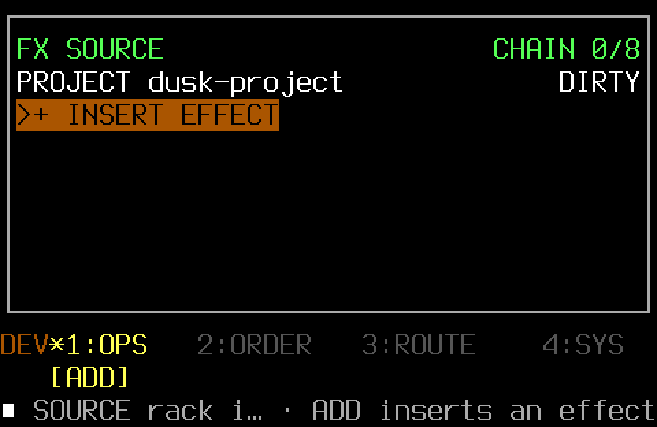

OPS exposes only `ADD`; unavailable edit and delete actions stay hidden.

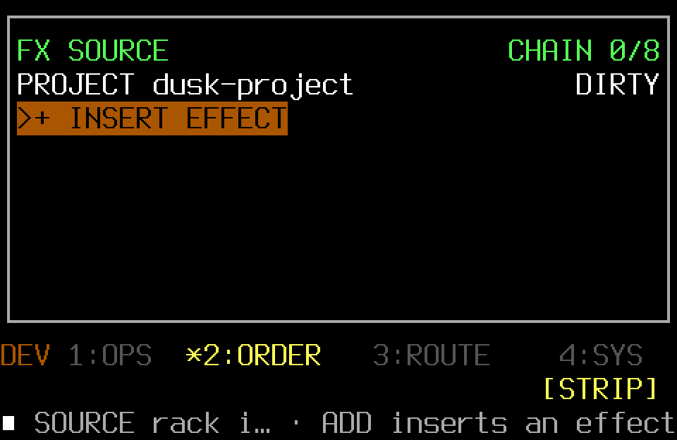

The empty MASTER rack's ORDER page still exposes `STRIP`; other targets ask
for MASTER rather than opening a misleading per-source mastering path.

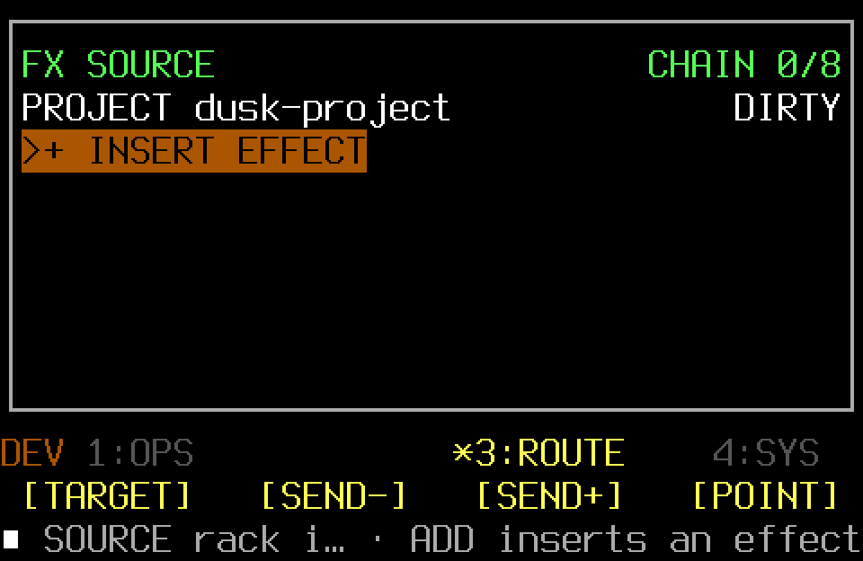

ROUTE still selects the target and, for an aux, its send settings.

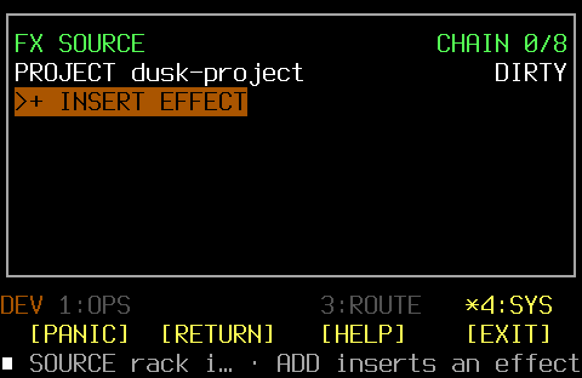

SYS preserves panic, return-level, help, and one-level exit actions.

### TYPE — choose or replace an effect type

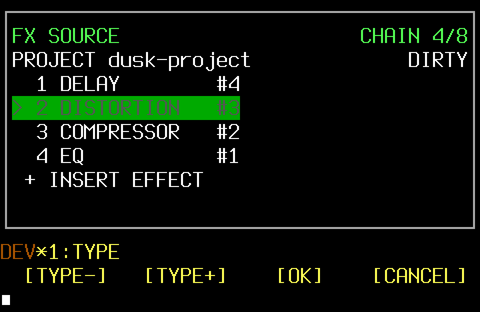

`TYPE-` and `TYPE+` browse compatible processors. `OK` confirms the new type;
`CANCEL` restores the original processor, or removes a newly inserted
provisional one. This context is distinct from `PARAM`, which edits named
values without changing the processor type.

## Fixed MASTER STRIP

The fixed strip follows the MASTER rack and live master fader. It is not an
effect slot and cannot be reordered. Its front page shows the owning Project
and saved/dirty state, INPUT, TONE, GLUE, COLOR, IMAGE, LOUD/CEIL, the selected
value, sample/true peak, LUFS, linked reduction, and correlation warning.
Browsing preserves the calling MTR/FX context and unrelated FT2 cursor.

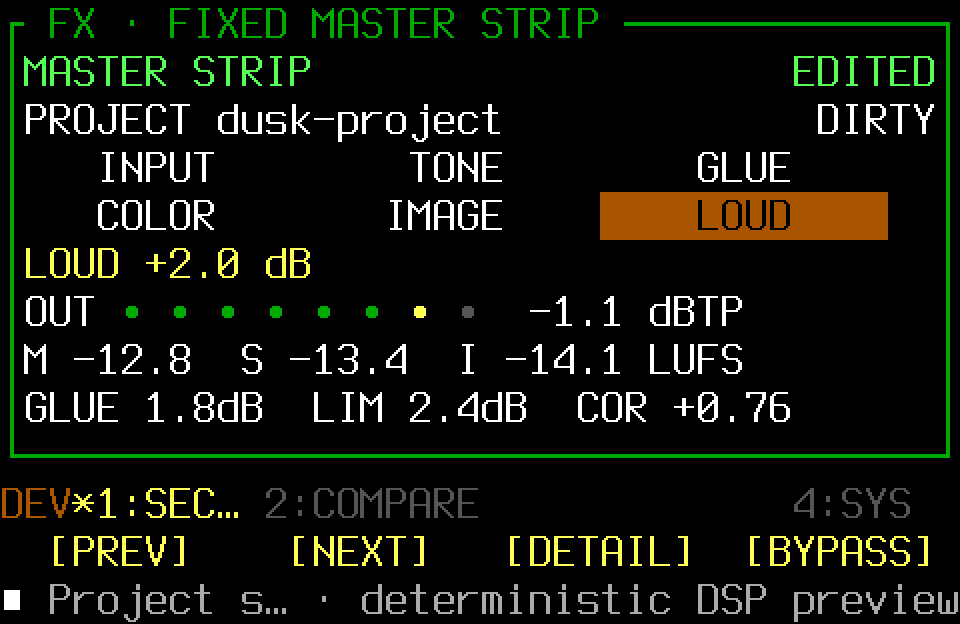

`PREV`/`NEXT` select one section, `DETAIL` opens its advanced values, and
`BYPASS` fades INPUT, TONE, GLUE, COLOR, or IMAGE. LOUD/true-peak protection
cannot be bypassed.

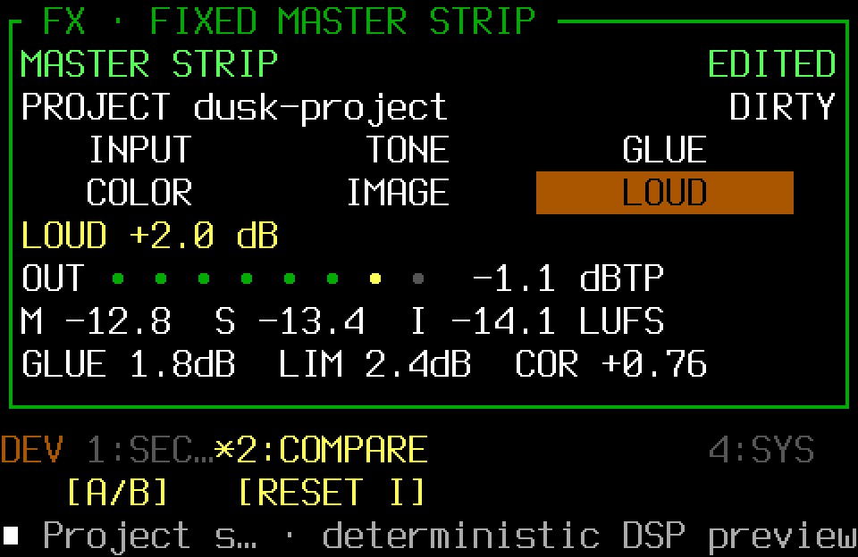

`A/B` compares the optional strip processing with the same fixed delay and
limiter. `RESET I` clears only integrated loudness. Edited settings stay
intact. Numerical and bypass updates are smoothed during playback; final
recording rejects them.

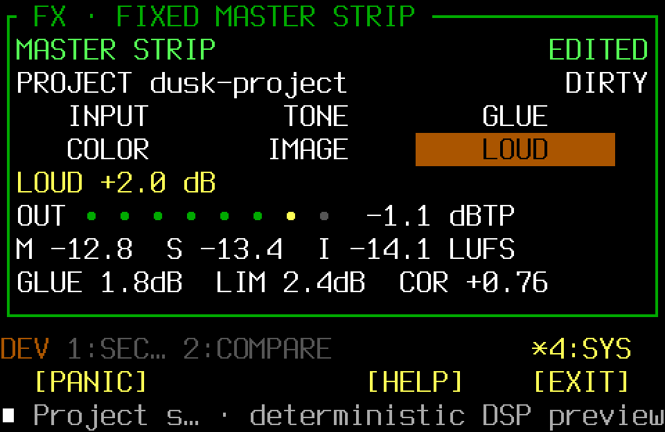

The front-page SYS commands keep `PANIC`, `HELP`, and `EXIT` available without
changing the selected section or caller.

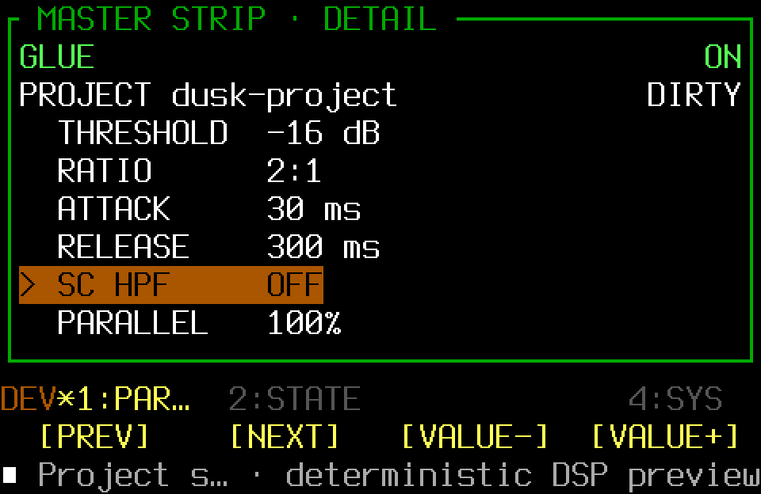

The detail page lists only the selected section's parameters. The ordinary
rotary browses its parameters; Shift-rotary selects the previous or next
section through the front-page order and starts at that section's first
parameter. `VALUE-` and `VALUE+` change the selected value.

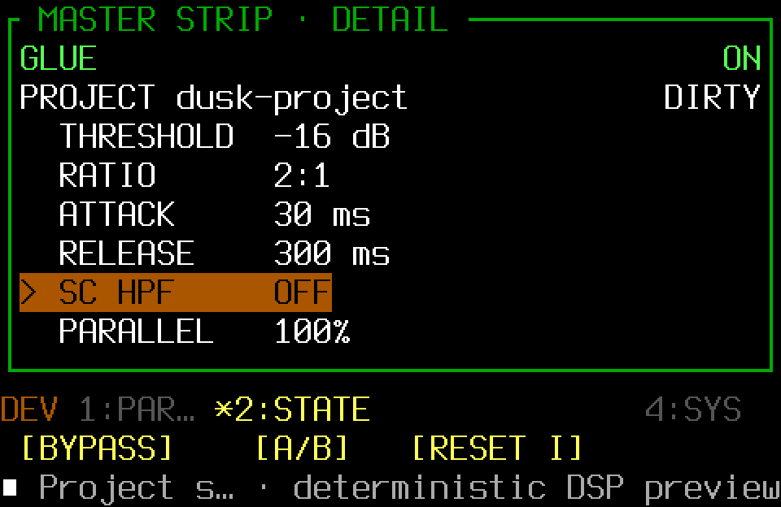

STATE retains section bypass, A/B comparison, and integrated loudness reset
while the detail values stay visible.

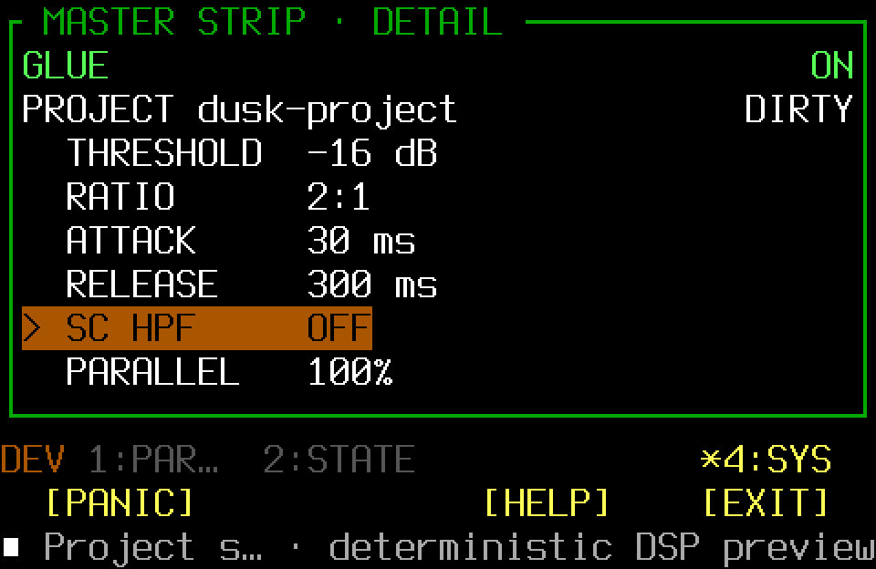

SYS keeps global Panic, contextual Help, and one-level Exit available from the
detail view.

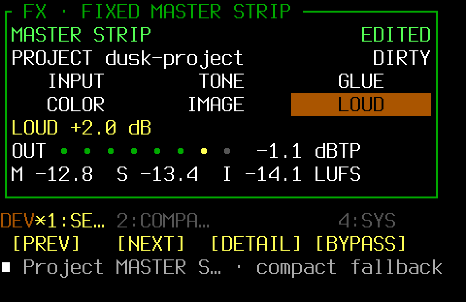

Below native geometry the screen compacts without drawing over the shared
status row. The exact DSP ranges, latency, true-peak tolerance, and provenance
are in [Fixed stereo MASTER STRIP](../MASTER_STRIP_MEASUREMENT.md).

## FX parameter editor

Parameters come from strict persisted schemas. Non-EQ effects use a curated
2×4 layout of at most eight controls that mirrors the physical rotary
positions. Each cell has the parameter title above its type-aware value; clear
names such as `RATE`, `RATIO`, `ATTACK`, and `FEEDBACK` replace cryptic
three-letter labels.

At 40×13, EQ uses a dedicated fullscreen editor:

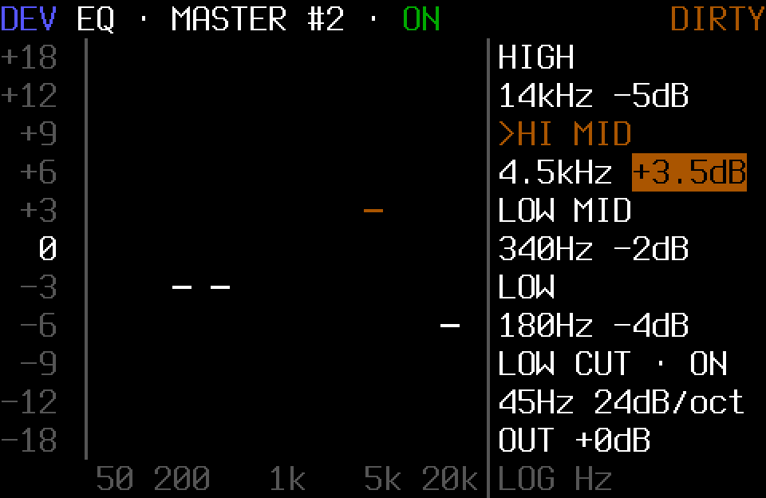

Its 20-column plot covers 50 Hz–20 kHz logarithmically. Low, low-mid, high-mid,
and high each use one movable `─`; vertical placement rounds to the nearest
labelled −18 to +18 dB row while the value readout and edit remain accurate to
0.5 dB. The master rotary browses bypass, all four frequency/gain pairs,
low-cut state and frequency, and output trim. Turn to browse, click to edit,
turn to change, click to confirm, and Back to restore the old value. Toggle
fields act immediately. Yellow is selected, green is editing, and bypass dims
the plot.

Knobs 1–4 remain logarithmic low, low-mid, high-mid, and high frequencies;
knobs 5–8 are their matching half-decibel gains. Low cut is not placed on knob
1. Existing off-grid Project values display honestly until edited, so this
surface does not invalidate saved Projects. Below 40×13, EQ uses the compact
generic editor.

The title/state uses one row and metering is bounded to one row. The compressor
shows 11 round red LEDs from 0.5 to 24 dB: dim circles keep the hardware-like
scale visible, while bright circles show live gain reduction and all stay dim
on bypass. Other processors use terse input/output values. Meter detail never
displaces a parameter.

Numeric keyboard entry follows the same range and type validation. There are
no duplicate PARAM± or VALUE± navigation buttons.

### STATE — bypass this processor

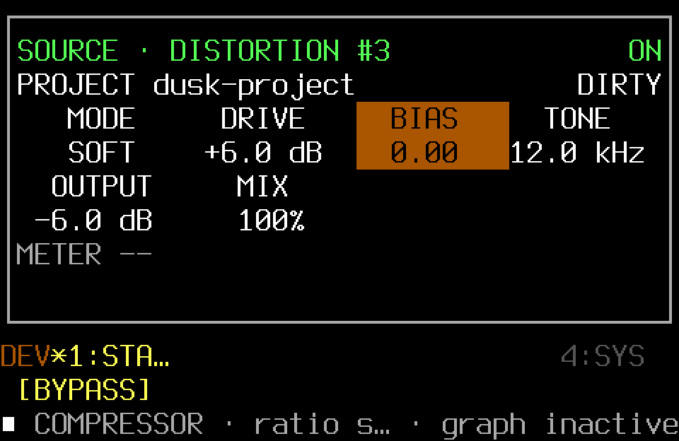

`BYPASS` toggles the edited processor without removing its ID, parameters, or
position. Bypass uses click-conscious smoothing in the active graph.

### SYS — safety and exit

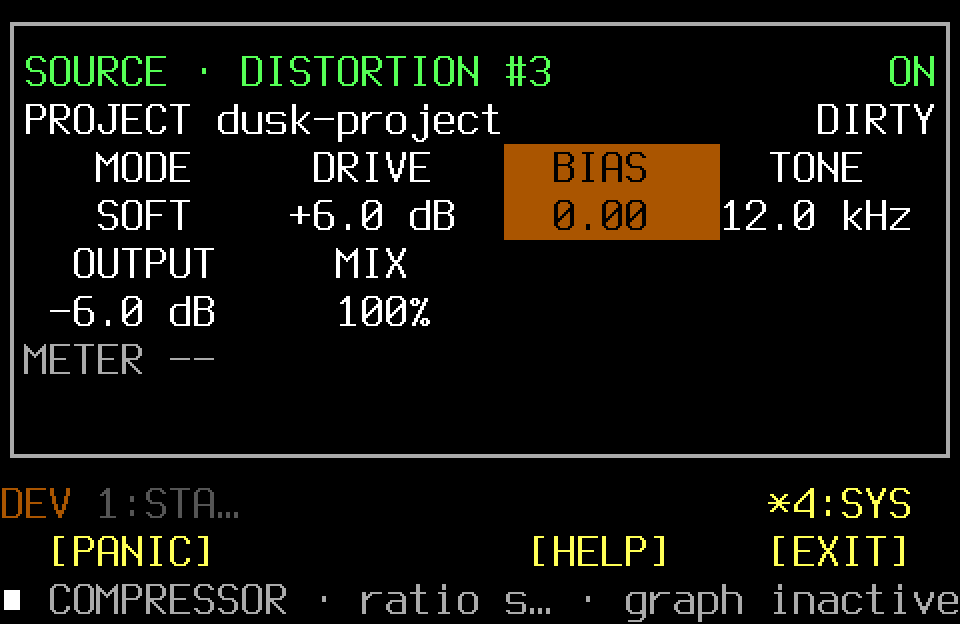

`PANIC` and `HELP` stay available. `EXIT` returns to the rack. Invalid or
non-finite parameter values are refused rather than published to audio.
