# FT2, Projects, and Patterns

[Manual home](../MENU_MANUAL.md) · [Everyday screens](EVERYDAY_SCREENS.md) ·
[Loops and effects](LOOPS_AND_EFFECTS.md)

SHR-DAW's FT2 screen is a compact vertical MIDI Pattern sequencer inspired by
tracker workflow. It is not an XM editor or a clone of FastTracker II. A
Project owns several Patterns and an Arrangement order. Each Pattern has one or
more four-lane pages. Portable `AUTO` pages defer destination and channels to
the active machine; explicit pages retain a destination plus each column's
channel, bank, and program.

The screenshots use a populated demonstration Project. External routes are
shown as offline where no actual device was opened for documentation.

At native 40×13 the Pattern body and compact page/lane footer end above the two
controller rows. The final row is the shared status row, so the tracker header
does not add a second `PLY`/`REC` label.

## FT2 Pattern — Play mode

Turn the main encoder to move rows. Hold the configured encoder Shift while
turning to select the previous or next column, including across page
boundaries. Keyboard Up/Down and Left/Right remain the row and column
alternatives. The shaded column is the live selection; the stronger yellow
cell cursor and highlighted row remain the next edit/play location.

### PLAY — transport and entry

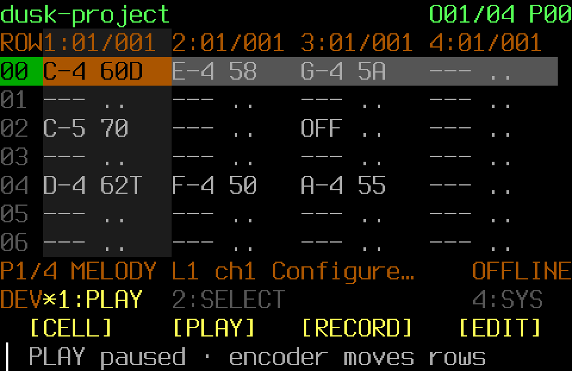

`CELL` opens the transactional editor. `PLAY` toggles tracker transport.
`RECORD` stops another active mode and starts the current Pattern record loop.
`EDIT` stops Play or REC before enabling note entry.

### SELECT — master overlays

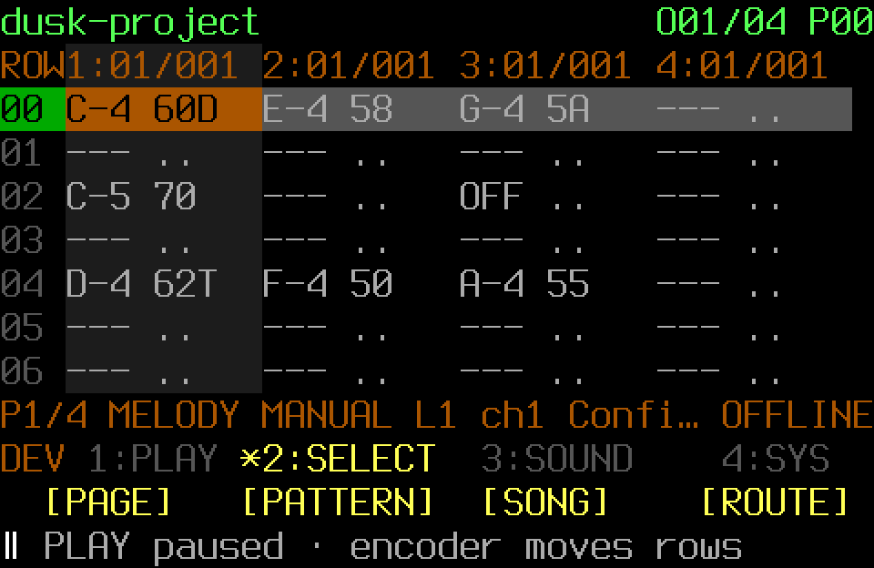

`PAGE`, `PATTERN`, `SONG`, and `ROUTE` open the reusable centered overlay while
the Pattern remains visible around it. Turn the master rotary or use Up/Down;
click/Enter selects. PAGE, PATTERN, and SONG keep only their highlighted
launcher on the overlay's bottom border near its original physical position.
ROUTE ends above a normal controller strip whose ROUTE page exposes APPLY and
CANCEL on the physical item buttons. The final row remains the shared status
row. Press an ordinary overlay's launcher again, or use keyboard Back/Esc, to
close. There is no extra controller Back item.

On 40×13 the ordinary overlay border is 38×11 at `(1,1)` with 36×9 usable
content. ROUTE reserves the two controller rows, so its border is 38×9 with
36×7 usable content.

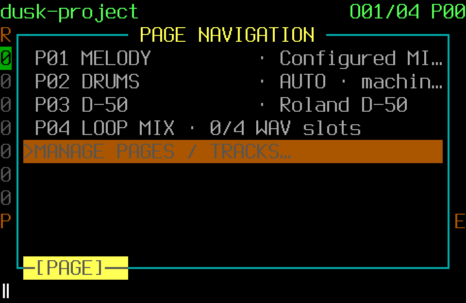

PAGE selects a page/column location and can open the detailed Tracks manager.

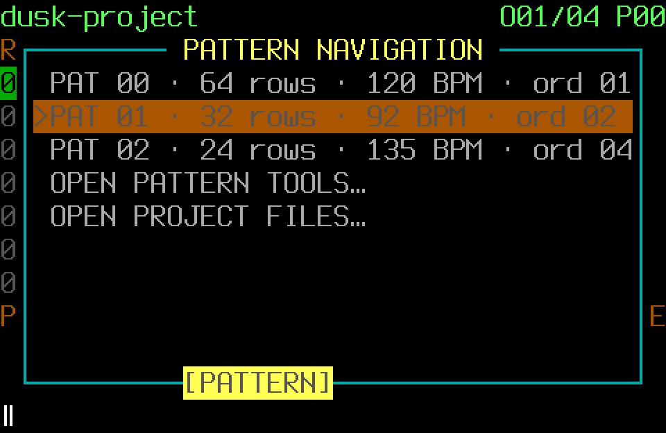

PATTERN selects an existing Pattern and links to Pattern tools or Project Files.

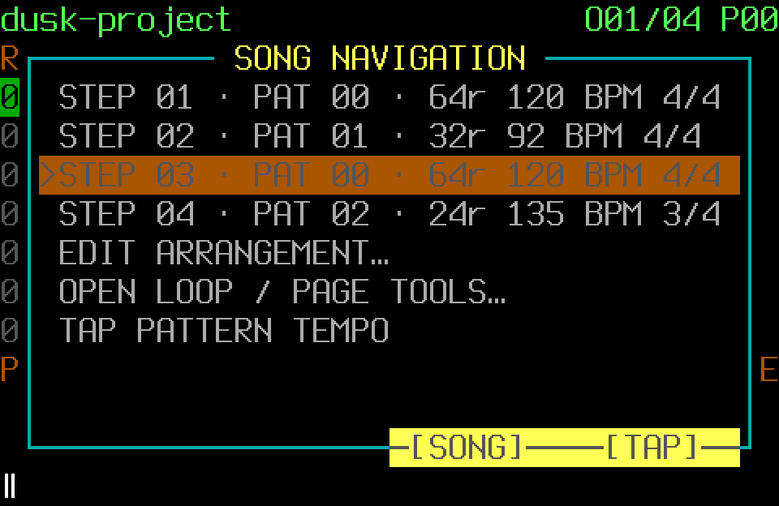

SONG selects an Arrangement step and links to Arrangement or page tools.

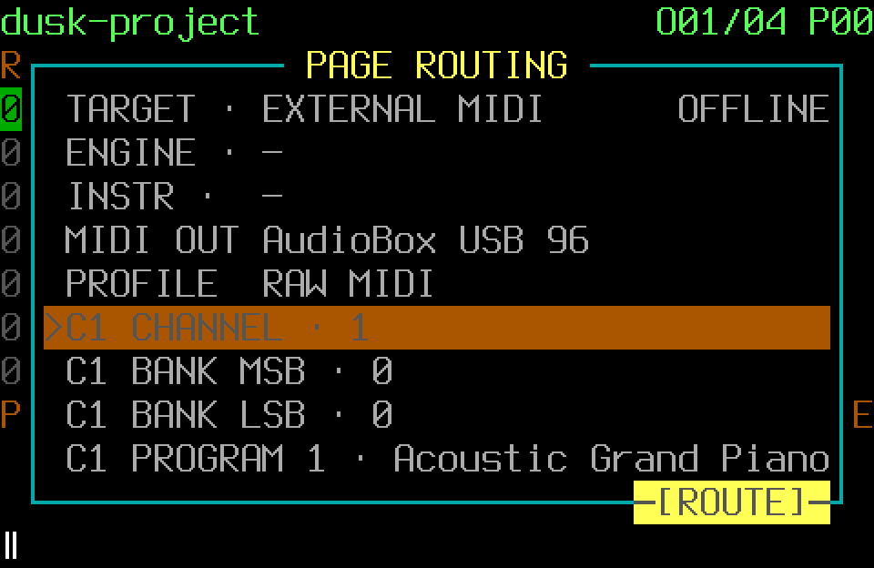

ROUTE edits a detached page-routing draft that changes the Project only on
Apply. For an SHR Drums target, choose `KIT`, click, and turn the encoder to
select any installed drum set; the redundant engine row is omitted. Applying a
different kit must start it before completing the route change. Failure keeps
the draft open and restores the previous kit. A successful change resets old
kit-specific tuning overrides while preserving the Project key and drum
effects.

### SYS — safety, filter, help, and exit

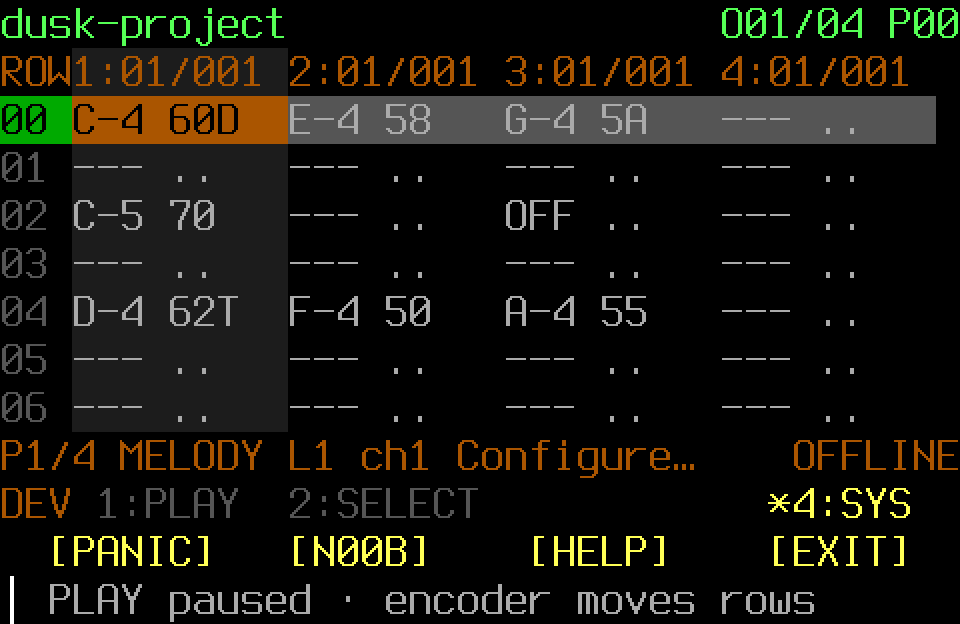

`PANIC` stops all owned notes and transports. `N00B` immediately toggles the
Player-selected scale filter without leaving Play. `HELP` opens contextual
help. `EXIT` returns Home.

## FT2 Pattern — real-time Record context

Record uses the selected page's exact online Pattern-owned software or hardware
instrument and its persisted Manual, One-column, or Drum-auto entry layout.
Incoming notes are quantized into the current transport position. Each note-on
owns its exact page/lane until its release, even across a loop or Arrangement
boundary. Turns are ignored—not queued—while recorded notes remain held. REC
from stopped transport owns its Pattern loop; REC during Play punches into the
current Arrangement and punch-out returns to Play. Key release writes a
quantized note-off independently of Edit note length.

### MODE — transport and capture

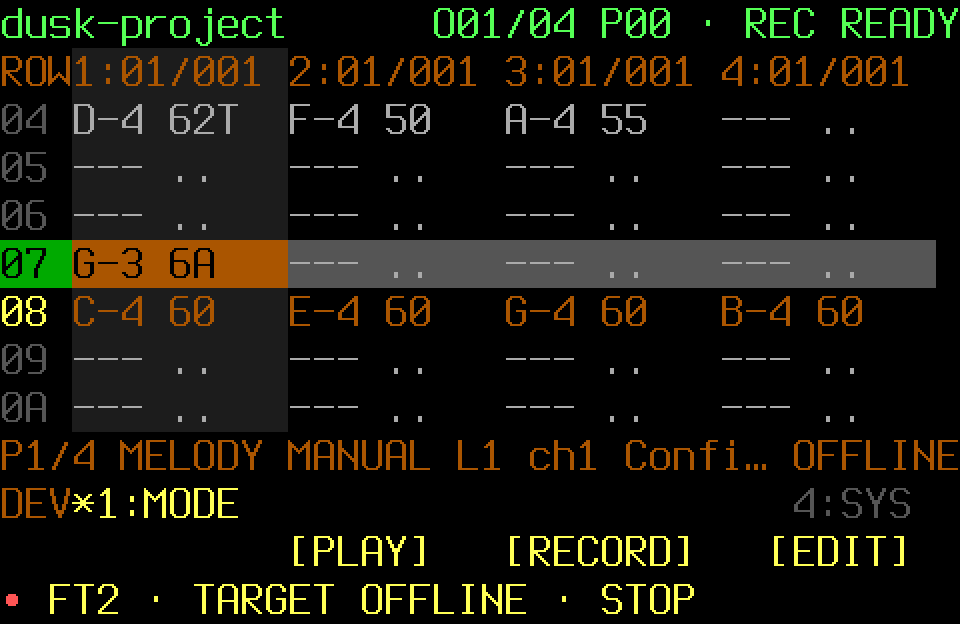

`PLAY` ends REC and starts normal transport. `RECORD` ends real-time capture
while preserving the notes already entered. `EDIT` ends REC and enters stopped
Edit mode. With N00B on, only allowed notes are heard and written.

### SYS — emergency and normal exits

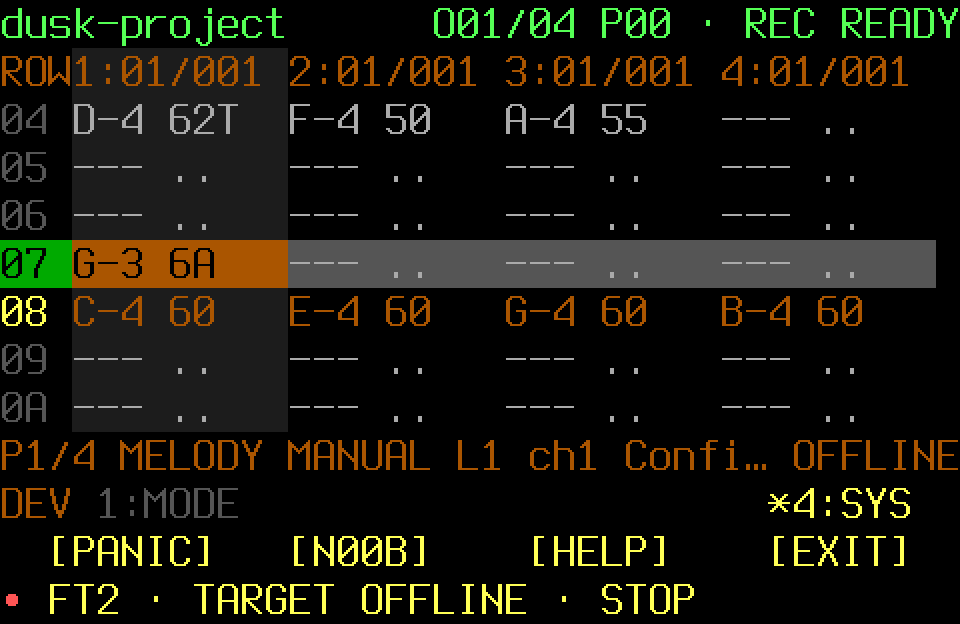

`PANIC` performs the global owned stop. `N00B` toggles the same independent
filter without ending capture. `HELP` explains the current mode. `EXIT` leaves
the recording context safely.

## FT2 Pattern — Edit context

In Edit, Manual writes from the selected column, One column redirects every
note to its displayed C1–C4 monophonic anchor, and Drum auto allocates a whole
simultaneous group without overwriting existing row cells or unrelated active
cymbal tails. Automatic placement never moves the visible lane cursor.
Command-pad notes remain controls. The persistent ADD value chooses any
advance from 0 through 32 rows after entry, blank, erase, or note-off; 0 stays
on the current row. `DRUM LANES FULL` rejects an unplaceable hit/group without
changing the Pattern.

### EDIT — enter or remove cells

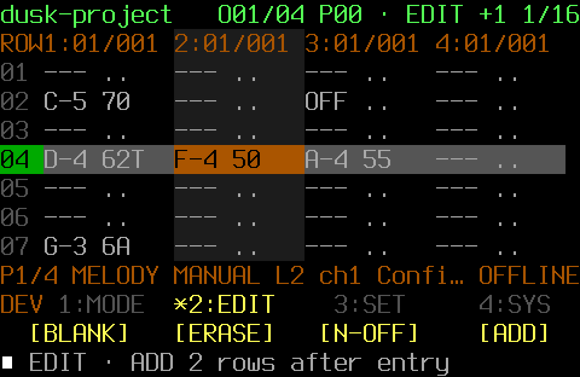

`CELL` opens contextual cell editing. `BLANK` advances without writing a note.
`ERASE` clears the selected cell. `N-OFF` writes a note-off. Edit contains no
duplicated Play, Record, or Edit mode buttons.

### SET — rotary selectors

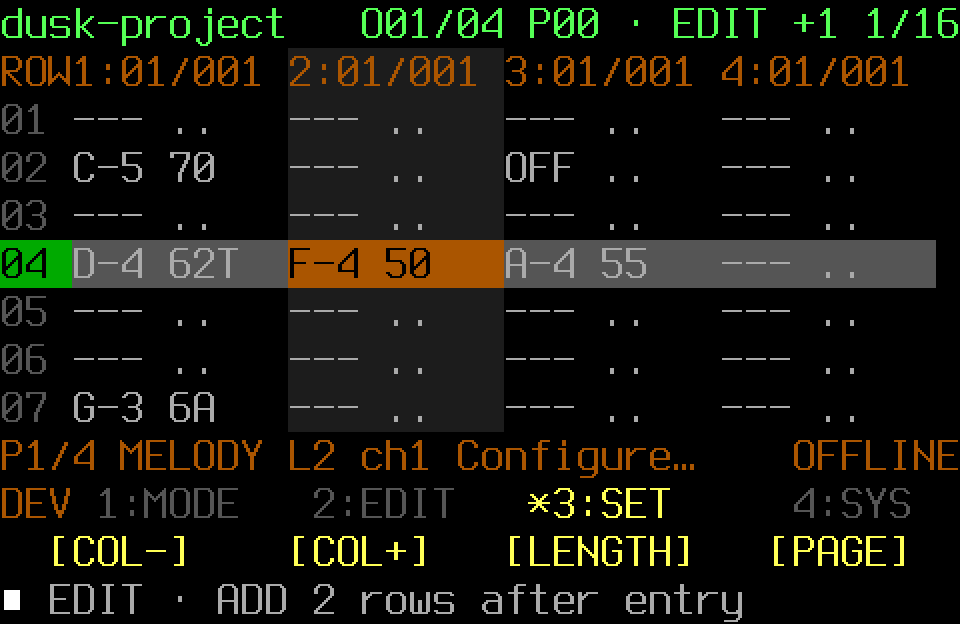

`LENGTH` opens every note duration from 1/1 through 1/128. `ADD` opens every
advance from 0 through 32 rows. Each selector opens on its current value;
turning changes the draft, clicking commits, and Back cancels without changing
the stored value. LENGTH and ADD remain independent. `COL-` and `COL+` move the
edit cursor between the page's four note columns.

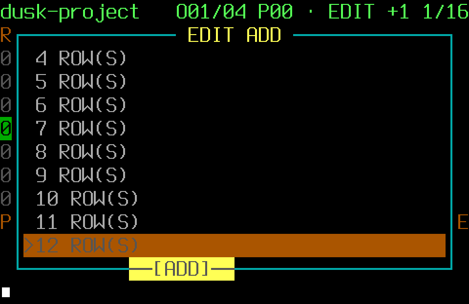

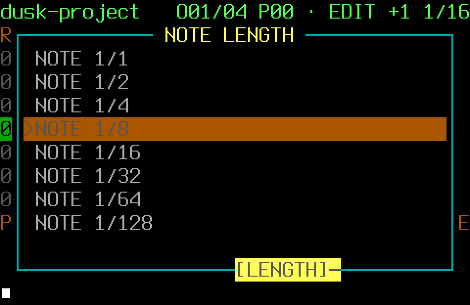

### SELECT — page and route

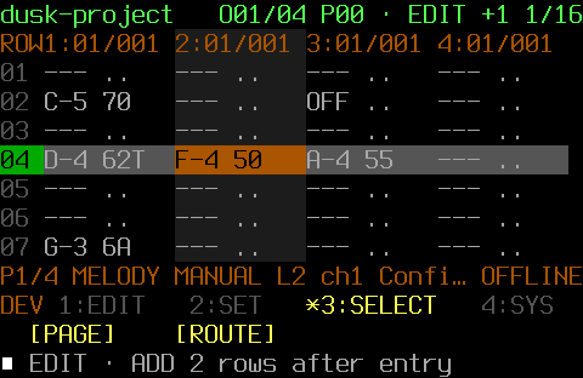

`PAGE` opens the normal page/column selector. `ROUTE` opens the selected
column's route editor. Both preserve Edit mode and use rotary turn, click, and
Back in the same way as their normal-FT2 counterparts.

### SYS — safety, help, and leave edit

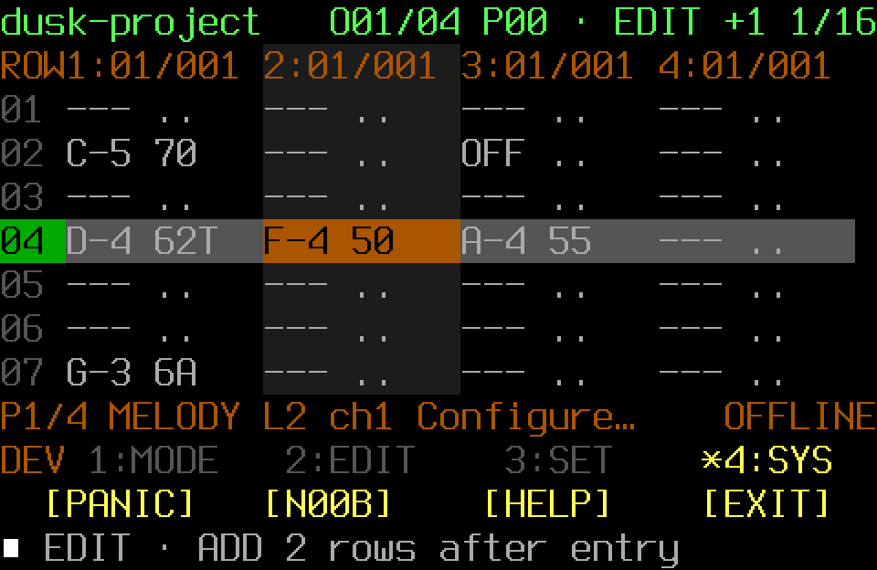

`PANIC` performs the owned stop. `N00B` toggles the same independent filter.
`HELP` opens contextual help. `EXIT` leaves Edit exactly one level and returns
to normal FT2 while preserving Pattern, page, column, and cursor row.

## FT2 Cell Edit

Cell Edit uses a draft copy: adjustments are not published until `CONFIRM`.
The cell can contain a note, inherited or explicit velocity, inherited or
explicit gate, an optional per-note program, and one command: cut, delay,
retrigger, tempo, or none.

### ROUTE — destination defaults for this cell

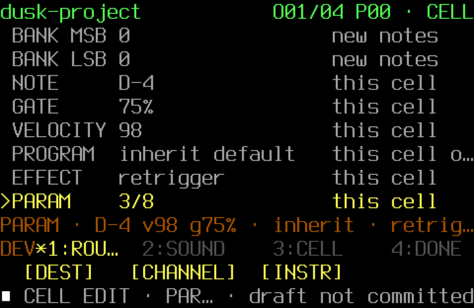

`DEST`, `CHANNEL`, and `INSTR` select the cell's route, channel, and inherited
instrument fields. Turning the master rotary adjusts the selected field in the
draft; the Pattern stays unchanged until `SAVE`.

### SOUND — banks and per-cell program

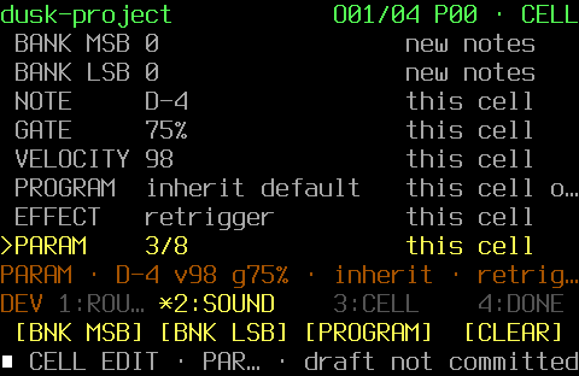

`BNK MSB`, `BNK LSB`, and `PROGRAM` select the MIDI sound-routing fields. `CLEAR`
clears only the selected field back to its inherited/default representation.
An explicit per-cell program is sent before that note on its exact target and
channel.

### CELL — musical content and command type

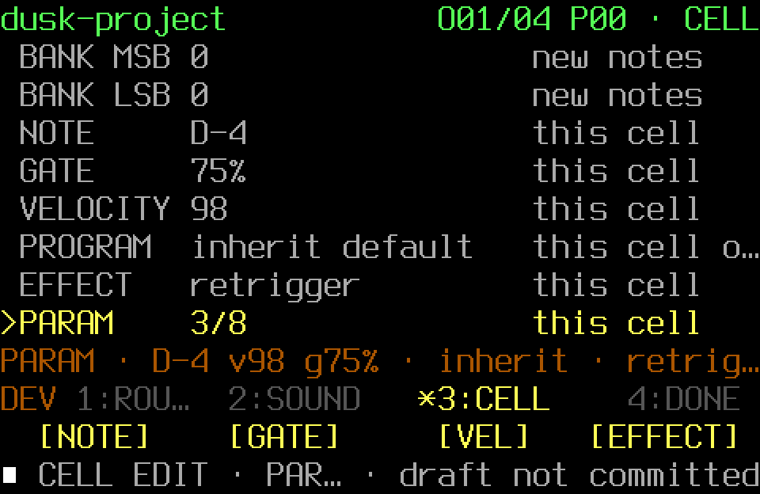

`NOTE`, `GATE`, and `VEL` select the corresponding value. Gate is a percentage
of one row; inherited values use the page/project default. `EFFECT` selects and
cycles cut, delay, retrigger, tempo, or none.

### DONE — save or cancel the draft

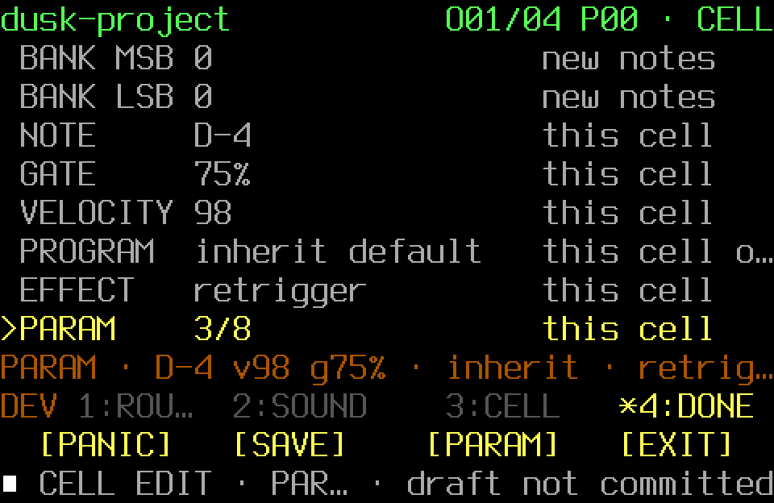

`PANIC` stays reachable. `SAVE` commits the whole draft. `PARAM` selects the
current command parameter. `EXIT` cancels and restores the original cell, so a
half-edited draft never leaks into the Project.

## FT2 Tools

This detailed child screen remains for Arrangement, Live Patterns, clip
operations, Loop Mix, effects, and muting. Open it from the SONG overlay's
`OPEN LOOP / PAGE TOOLS` row.
Quick Page, Pattern, Song, and Route selection stays in the master overlays.

### OPS — open focused tools

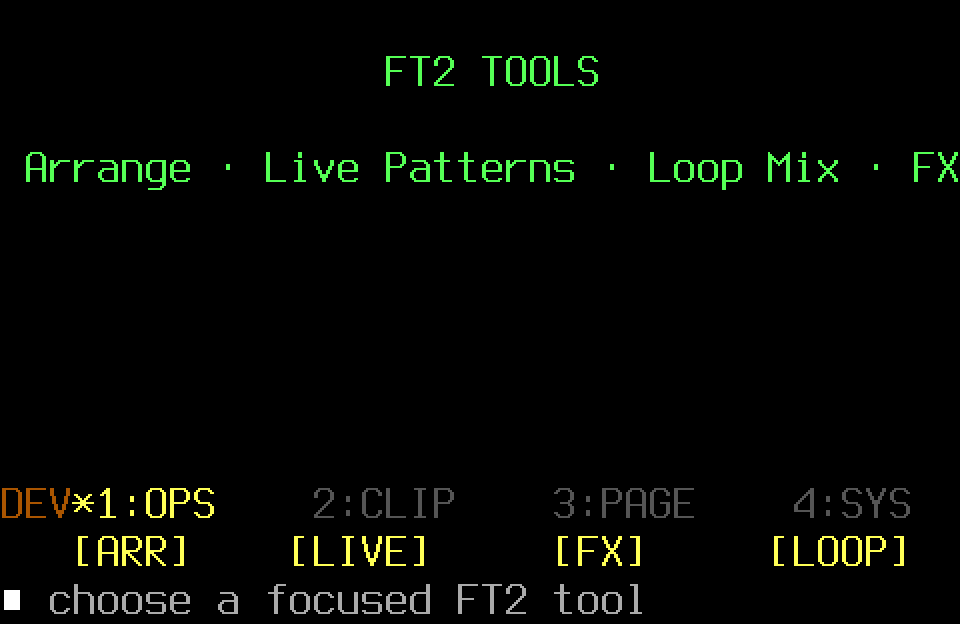

`ARR` opens the saved Arrangement. `LIVE` opens Live Patterns. `FX` opens the
Project effects rack. `LOOP` opens the four-slot Loop Mix.

### CLIP — lane and page clipboard

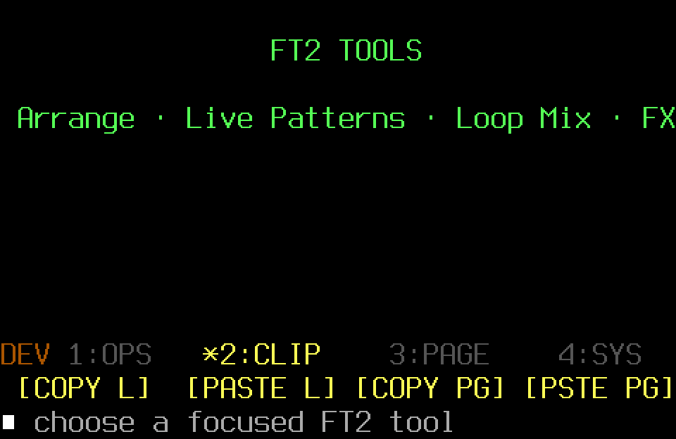

`COPY L`, `PASTE L`, `COPY PG`, and `PSTE PG` copy or paste the current lane or full
four-lane page. These are in-memory editing clipboards, not saved Projects.

### PAGE — page mute

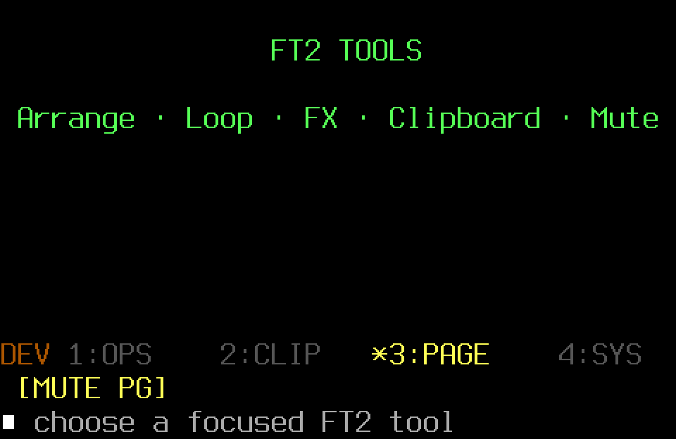

`MUTE PG` toggles the current four-lane page. `MUTE` toggles the selected
stored tracker lane. Transient performance mute remains on Live Patterns.

### SYS — safety, help, and return

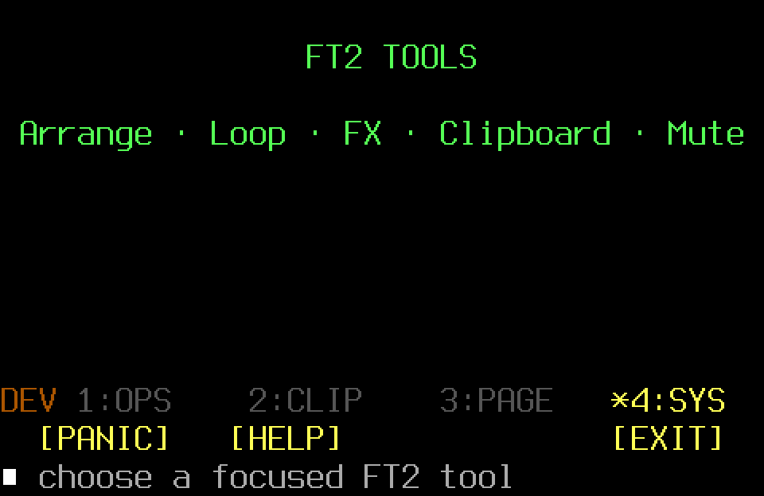

`PANIC` and `HELP` retain their normal meanings. `EXIT` returns to the
Pattern editor.

## Live Patterns

Live Patterns performs existing tracker Patterns without changing the saved
Arrangement. Browsing changes the white selection only. Green `PLAY` and yellow
`Q` identify current and queued Patterns independently, while the lower rows
show transient lane shaping. Each row's loop count belongs to that Pattern;
launch and retrigger switch/restart its MIDI and Loop Mix together.
The ordinary rotary browses Patterns or adjusts the selected shape control;
Shift-rotary changes lane through the existing Left/Right action.

### LAUNCH — select, queue, cancel, retrigger

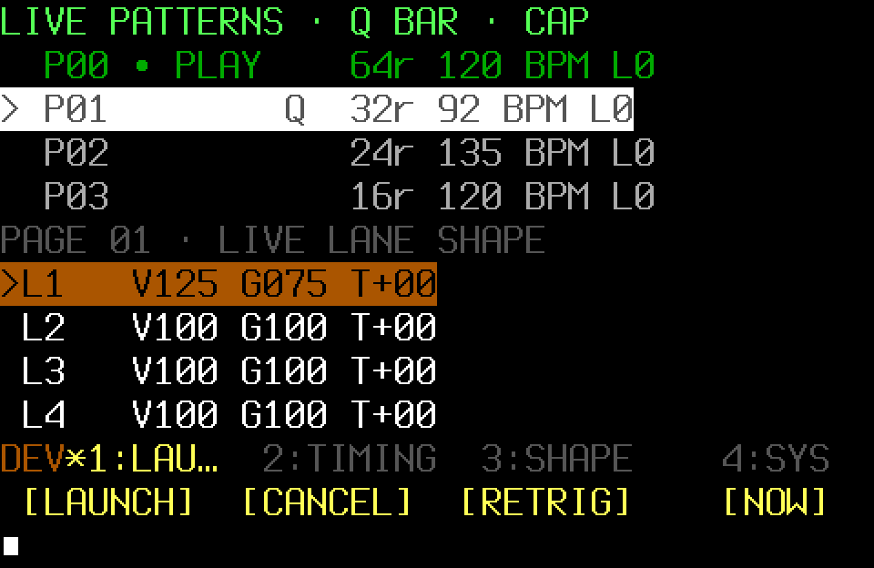

`LAUNCH` queues the selected Pattern. `CANCEL` removes the queue. `RETRIG`
queues the current Pattern deliberately. `NOW` is the distinct immediate
action.

### TIMING — boundary and capture

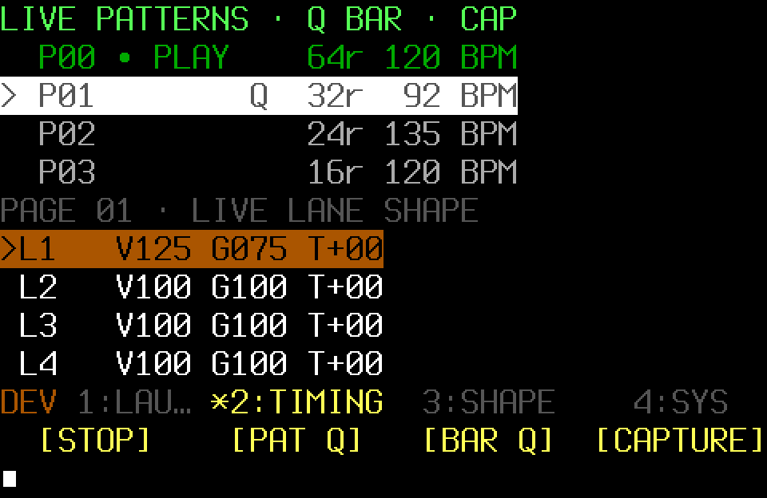

`STOP` is literal transport stop. `PAT Q` and `BAR Q` choose the next Pattern
or complete-bar boundary. `CAPTURE` arms/stages/cancels temporary launch
capture without silently changing Arrangement.

### SHAPE — transient four-lane performance

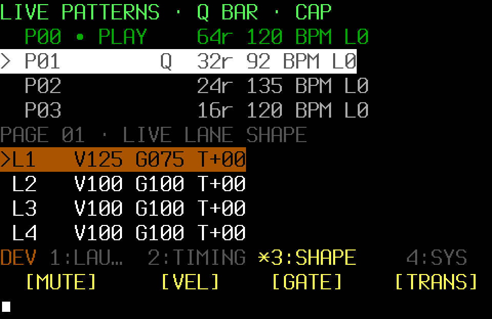

`MUTE`, `VEL`, `GATE`, and `TRANS` affect the selected page/lane runtime copy.
Values survive navigation in this Project and reset on Project load/new.

### SYS — safety and capture confirmation

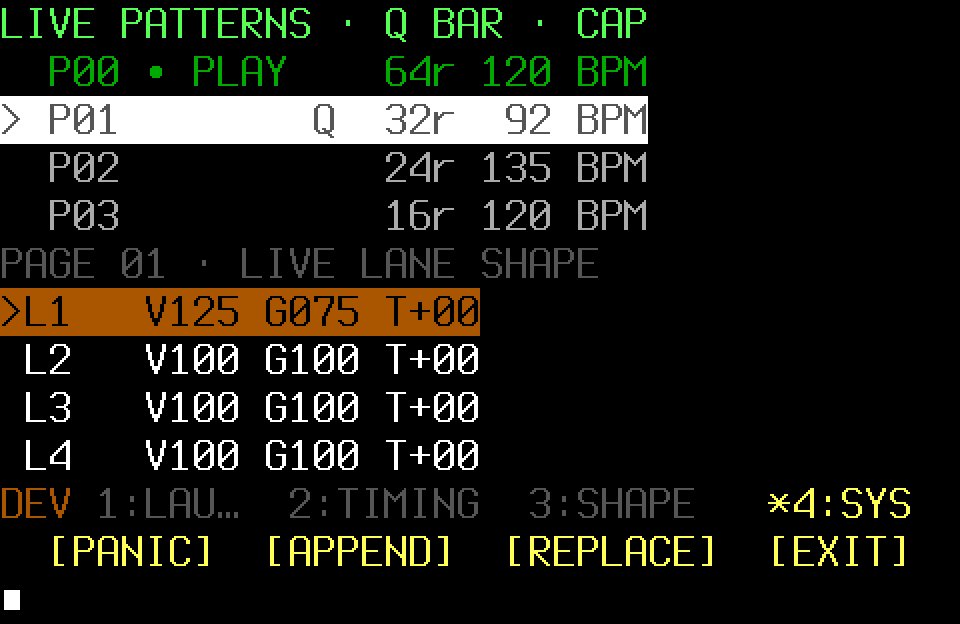

`PANIC` remains global. `APPEND` or `REPLACE` explicitly confirms a staged
capture; repeated launches remain repeated Pattern references. `EXIT` returns
without moving the editor cursor.

See [Live performance](../LIVE_PERFORMANCE.md) for exact boundary ownership,
keyboard equivalents, failures, and deliberate limits.

## N00B filter and Edit note length

N00B is an independent scale-filter switch, not a fourth FT2 mode and not a
duration control. Player owns the scale choice: enabling N00B there adds one
compact `SCALE` rotary to the unchanged Player screen, and turning the master
encoder cycles every chromatic root in major and natural minor. FT2 uses that
selection. On a melodic page, an in-scale key keeps its original pitch and an
out-of-scale key stays silent; no rejected key is shifted to a nearby note.
The FT2 button stays in the same SYS position, toggles the filter immediately,
and can stay on through Play, Record, and Edit; moving to Drums turns only the
filter off.

Note duration belongs separately to Edit. `LENGTH` opens an overlay for
`1/1` through `1/128`; it does not change the independent 0–32-row `ADD`
advance.

## Project Files

Files manages complete saved Projects. Names shown to the musician are
editable. Save and Save As publish atomically and never silently replace a
collision. Preview uses the selected saved Project without treating it as the
current edit.

### OPS — save, load, delete, MIDI import

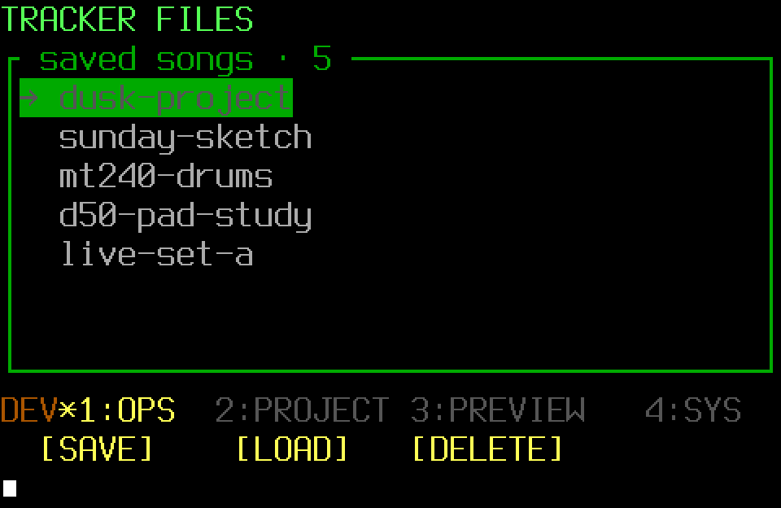

`LOAD` opens the selected Project. `SAVE` writes the current Project and asks
before replacement. `DELETE` requires repeat confirmation. `MIDI` uses the
empty fourth position to open the private Standard MIDI File inbox. Selecting
or pressing LOAD first analyses the file and shows parts/pages, Pattern rows,
tempo/meter, timing accuracy, stripped-event counts, and warnings; a second
action confirms the new unsaved Project. A dirty LOAD or MIDI import first
opens the four-row rotary guard: `SAVE (AUTO)`, `SAVE (NAME)`, `DON'T SAVE`,
and `BACK`. Back or a failed/pending save keeps the Project and exact tracker
position.

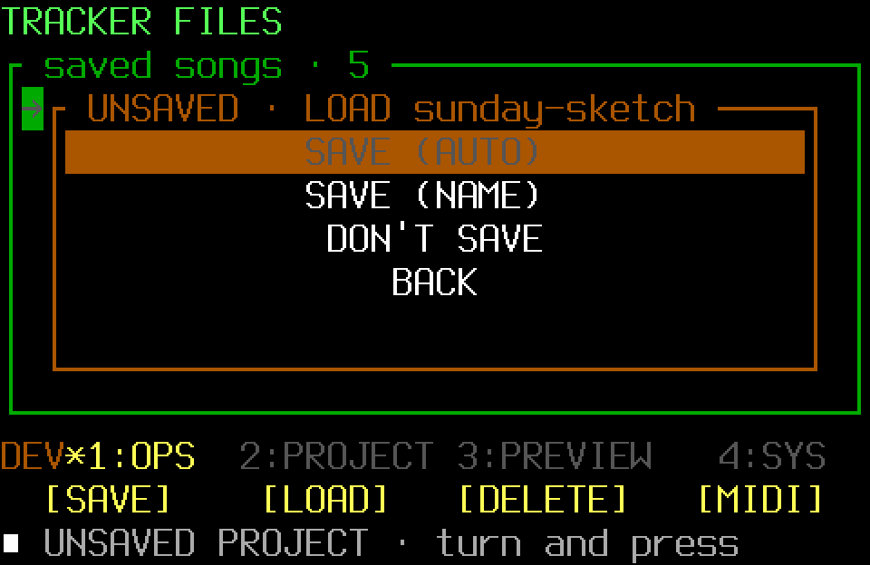

The MIDI browser follows no symlinks and accepts bounded regular `.mid` and
`.midi` format 0/1 PPQN files only. It never previews, transmits, or overwrites
the source file or an existing Project. Saved-Project `PREVIEW` remains on the
separate PREVIEW command page.

### PROJECT — lifecycle and Pattern child

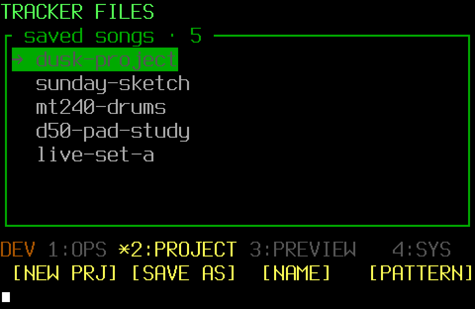

`NEW` creates a confirmed blank Project. `SAVE AS` writes a numbered
non-overwriting copy. `NAME` opens the current Project display name; rotary
click accepts it and computer-keyboard editing is optional. `PATTERN` opens
Pattern tools.

### SYS — safety, help, and return

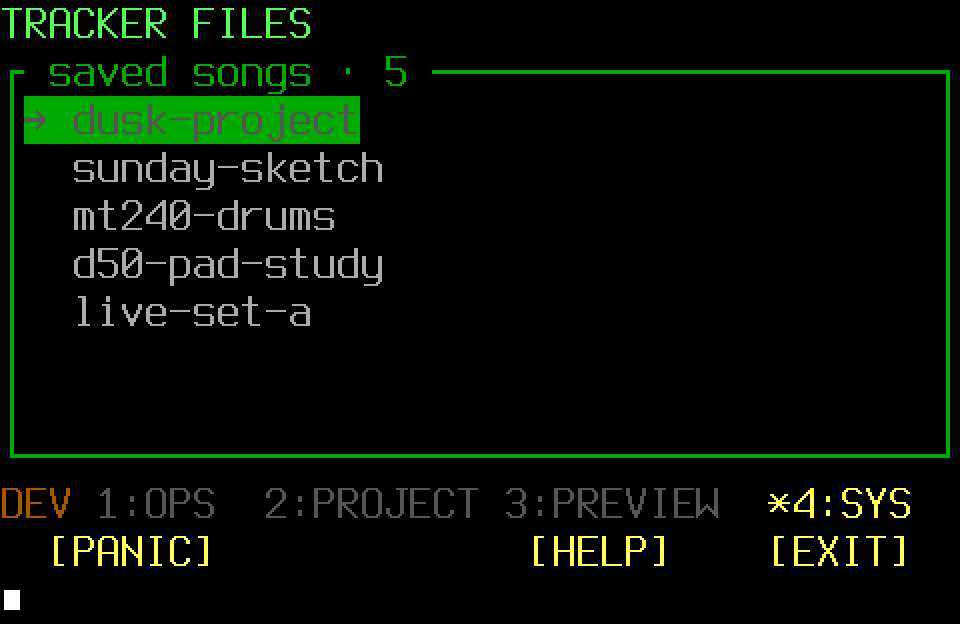

`PANIC` and `HELP` remain available. `EXIT` cancels pending file actions and
returns to the tracker.

Dirty FT2 Exit, New Project, LOAD, confirmed MIDI replacement, and application
quit all use the same guard. It opens on `SAVE (AUTO)`. An unsaved automatic
save chooses the next free Project name; `SAVE (NAME)` supplies the same kind
of collision-free suggestion before optional editing. Continuation happens
only after a completed save. `DON'T SAVE` explicitly restores the clean
Project baseline before leaving FT2, including its routing, effects, and Loop
Mix ownership. `BACK` and Esc return to the exact caller and context.

When saving a changed blank Pattern, SHR can offer its routing as the private
default for future Patterns.

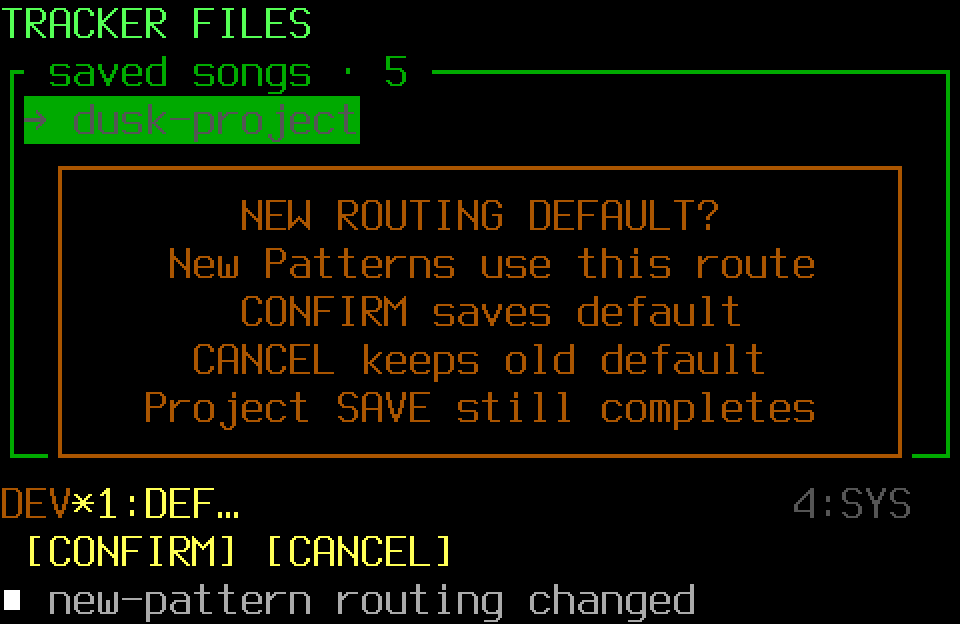

`CONFIRM` queues the template and writes it only after the Project save
succeeds; `CANCEL` keeps the previous default.

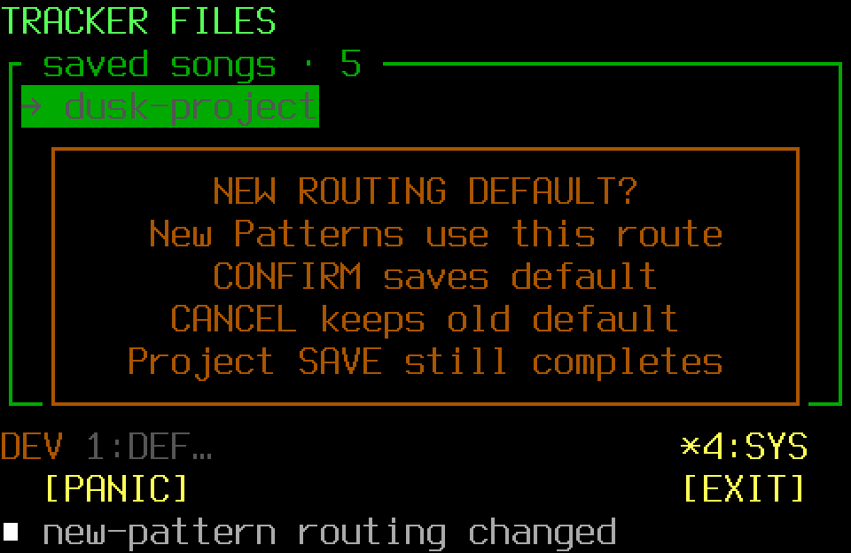

SYS keeps panic and exit/cancel reachable; neither choice changes notes.

## Pattern tools

Pattern tools operate on the Pattern referenced by the current Arrangement
step. Cleanup deletes only zero-reference Patterns; it never rewrites the
Arrangement behind the user's back. Transposition affects melodic pages only.

### OPS — Pattern lifecycle

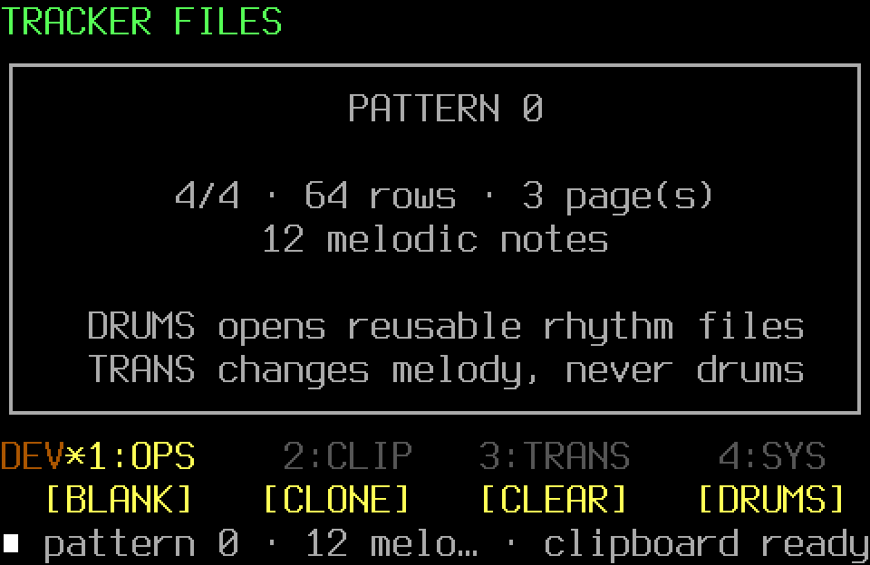

`BLANK` opens Pattern setup with empty Loop Mix slots. `CLONE` creates a
separate copy of MIDI and all four loop references/settings and selects it.
`CLEAR` opens a confirmed clear/resize setup; when loops are attached the prompt
states how many will detach. `DRUMS` opens reusable rhythms.

### CLIP — Pattern clipboard and cleanup

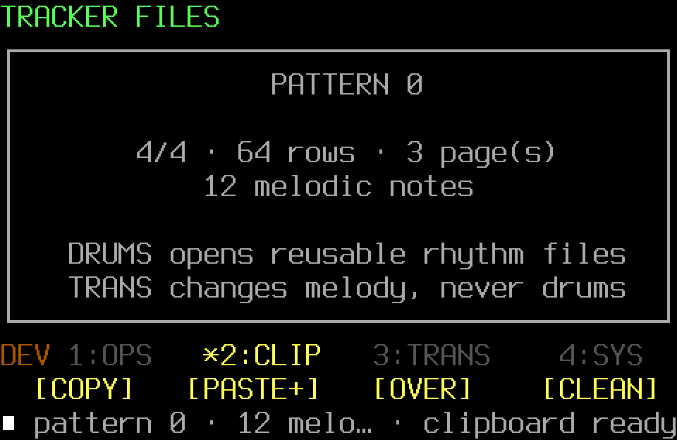

`COPY` stores the complete Pattern, including Loop Mix, in memory. `PASTE+`
creates an independent new Pattern from it. `OVER` asks before replacing the
current Pattern, including its loops. `CLEAN` deletes only Patterns not
referenced by any Arrangement step and never deletes private WAV files.

### TRANS — transpose melody only

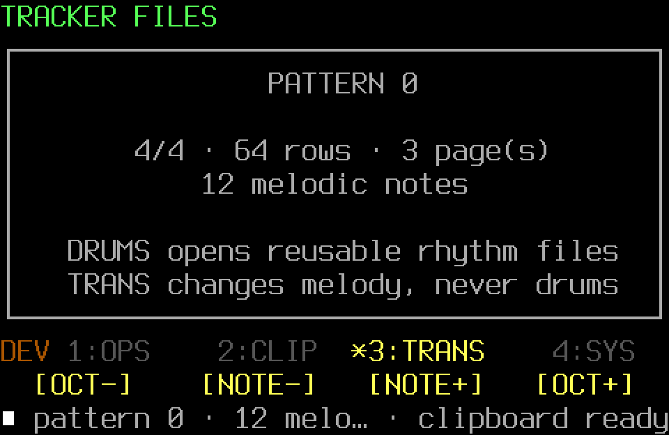

`OCT-`, `NOTE-`, `NOTE+`, and `OCT+` transpose melodic notes by −12, −1, +1,
or +12 semitones. Percussion pages and note-off commands are left unchanged.

### SYS — safety, help, and return

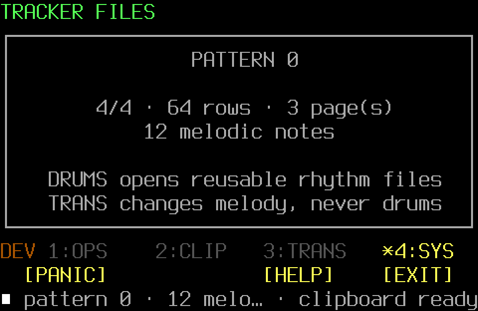

`PANIC` and `HELP` stay available. `EXIT` returns to Project Files.

## Drum patterns

The library contains bundled read-only grooves plus user-saved four-lane drum
Patterns. Filters select genre, 3/4 or 4/4, and supported two-, four-, or
eight-bar row sizes. Loading may resize an empty melodic Pattern, but refuses a
shape change once melody exists.

### OPS — load and manage a rhythm

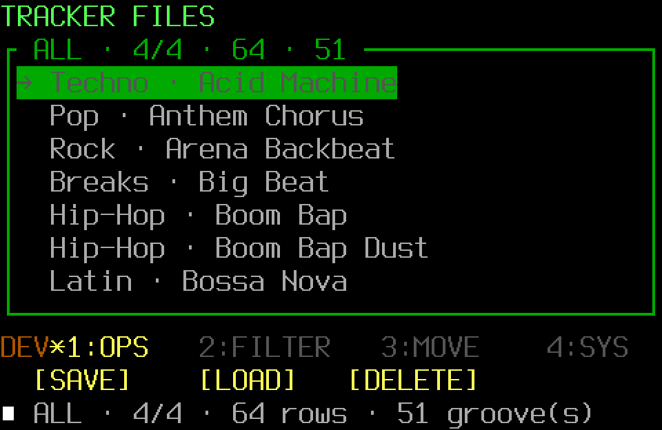

`LOAD` writes the selected rhythm into the percussion page without changing
its route. `SAVE` stores the current percussion page as a user rhythm.
`DELETE` can remove only a user save and requires confirmation.

### FILTER — narrow the library

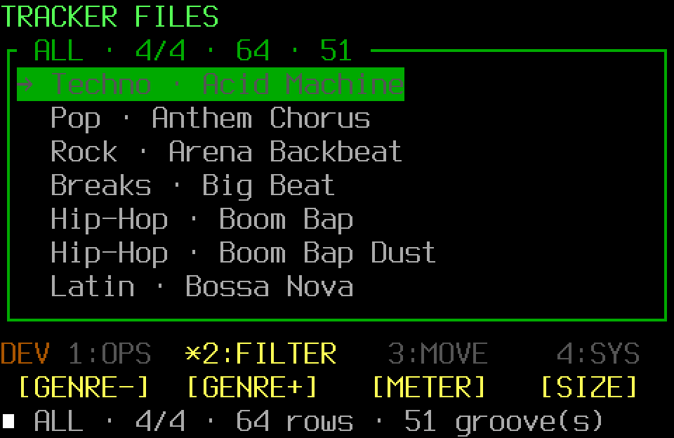

`GENRE-` and `GENRE+` move among the available genres and `ALL`. `METER`
toggles 3/4 and 4/4. `SIZE` cycles the supported Pattern lengths for that meter.
Shift-rotary reuses the genre actions in both directions while the ordinary
rotary continues to browse rhythms.

### MOVE — navigate a long result list

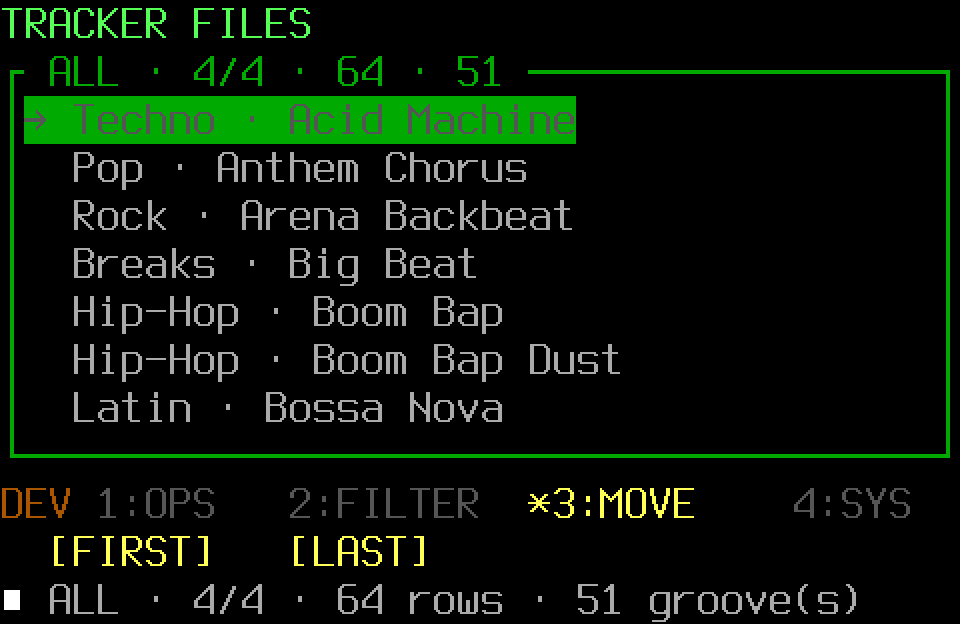

`FIRST` and `LAST` move to the filtered result-list boundaries without loading
anything. Turn the rotary for one-step movement, type a first letter to jump,
or use keyboard PageUp/PageDown for coarse scrolling; physical pads omit the
coarse page commands.

### SYS — safety, help, and return

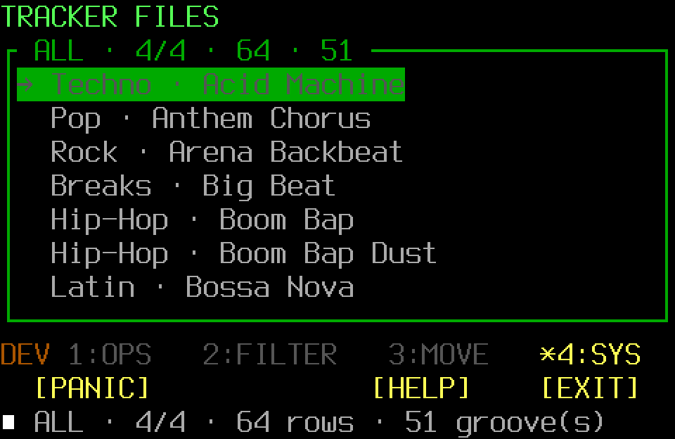

`PANIC` and `HELP` remain available. `EXIT` returns to Pattern tools.

## Pattern setup

This confirmation context chooses musical meter and row count before a new or
destructively cleared Pattern is created. `LNGTH` opens a rotary overlay with
every row count from 1 through 32 plus 48, 64, 96, 128, 192, and 256.

### OPS — meter and size

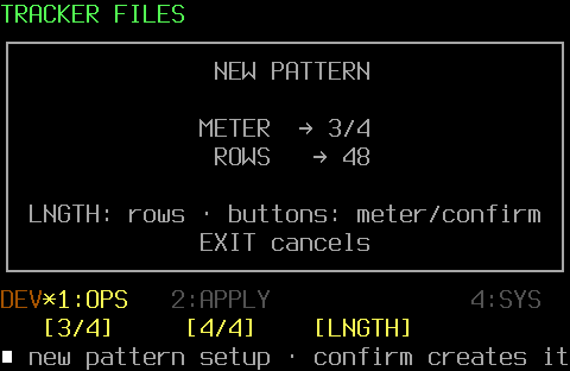

`3/4` and `4/4` choose the meter without silently changing the row count.
`LNGTH` opens the row-count overlay; turning browses and clicking keeps the
highlighted value in the still-unconfirmed Pattern setup.

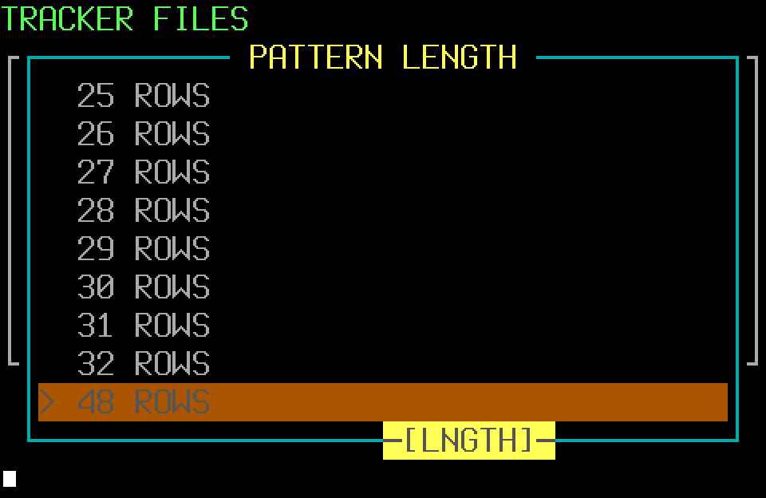

### APPLY — confirm or preserve

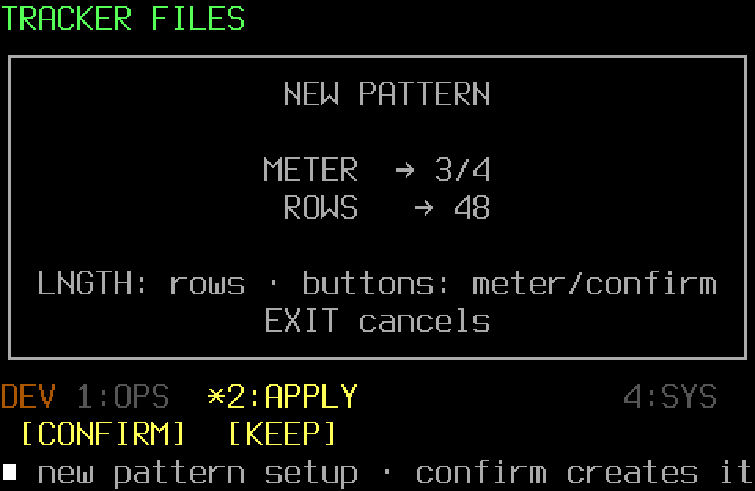

`CONFIRM` performs the requested NEW or CLEAR operation with the displayed
meter and length. `KEEP` also performs the operation, but preserves the current
Pattern's meter and length: NEW creates a blank Pattern with that shape, while
CLEAR clears content without reshaping it.

### SYS — safety and cancellation

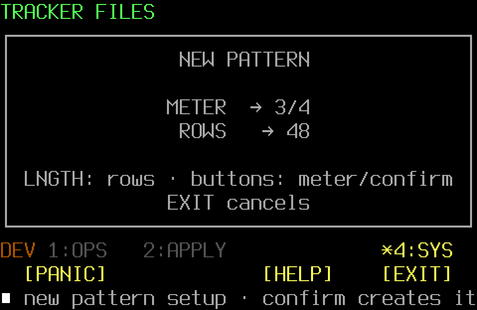

`PANIC` and `HELP` remain available. `EXIT` cancels the setup and returns to
Pattern tools.

## Arrangement

Arrangement is the ordered list of Pattern IDs that forms the Project
timeline. Repeated steps reference the same Pattern until it is cloned.

### OPS — play and insert Pattern references

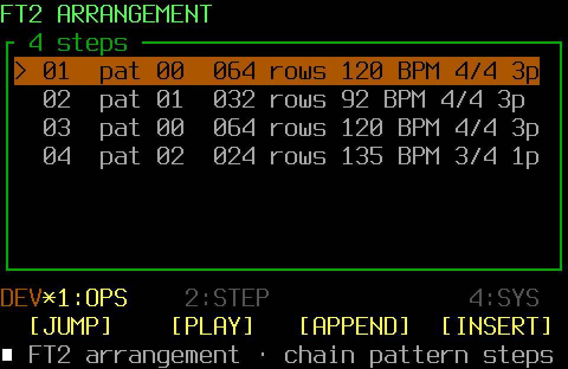

`PLAY` starts at the selected step. `JUMP` opens that step's Pattern in the
editor. `APPEND` adds the current Pattern at the end. `INSERT` adds it before
the selected step.

### STEP — reorder and repeat

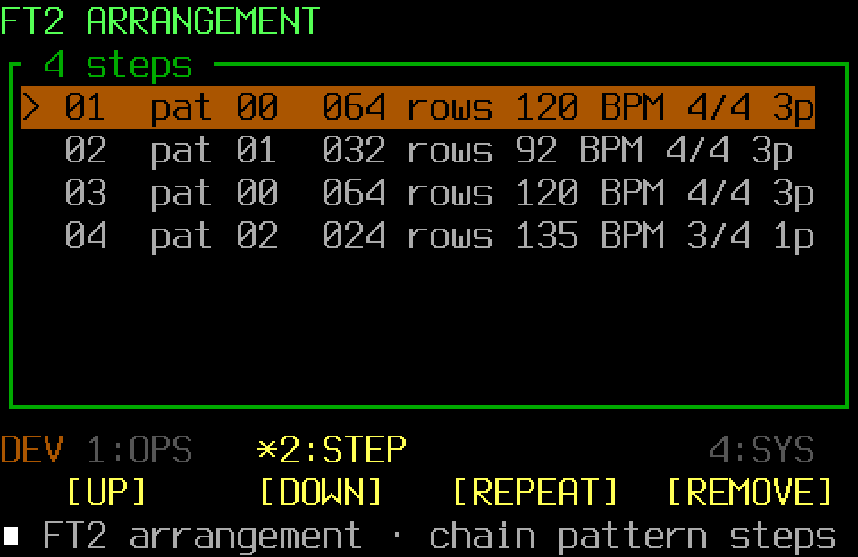

`UP` and `DOWN` move the selected step earlier or later. `REPEAT` duplicates
the reference. `REMOVE` removes only this step, not the underlying Pattern.

### SYS — safety, help, and return

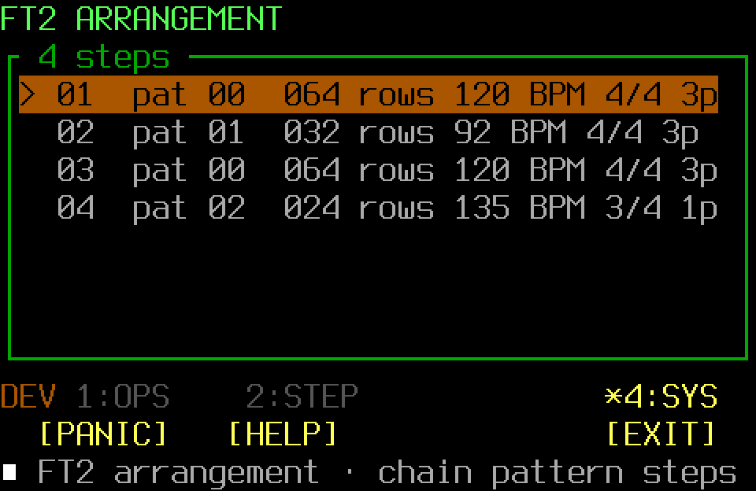

`PANIC` and `HELP` remain available. `EXIT` returns to the tracker.

## ROUTE master overlay

ROUTE is the quick transactional editor for the active Pattern page. The top
rows show the page/master destination and its current resolved state, the
software engine/instrument, SHR Drums kit, or external MIDI output, and the
optional device profile as applicable. The next 16 rows show channel, bank MSB,
bank LSB, and program/instrument for each of the page's four columns;
profile-provided instrument names appear when available. Long names are
deliberately shortened inside the border.

Turn to a row and click/Enter to make that field active. Only then does rotary
movement change the detached draft. Click/Enter keeps the field in the draft;
Back/Esc restores that field's prior value. `APPLY ROUTING` validates and
copies the page through the existing Project owner, releases old auditions,
and runs the existing route synchronization. Confirming an external PROGRAM
field also sends that column's bank/program selection immediately for hardware
free play; `APPLY ROUTING` sends the selected column's program again. Until
Apply, the Project, runtime route, engine, transport, and recorder are otherwise
untouched.

The standard bottom controller action row always shows `APPLY` and `CANCEL`, so
neither whole-draft action depends on scrolling to the final list row.
Positions 5 and 8 activate those exact actions on the controller; mouse and
keyboard `A`/`C` share them. Back/Esc from the main list cancels the draft,
while Back/Esc during a field edit cancels only that field.
Missing preferred hardware remains visible and saved as preferred; an exact
external target stays offline or ambiguous and never uses either the
configured hardware default or the Pattern's software synth. `AUTO` alone
keeps portable machine-default behavior and owns no explicit
channel/bank/program values.

## Tracks and routing

The Tracks screen edits four-lane pages. Changes are kept as a draft until
`DONE`; `EXIT` restores the original Project. Turn the encoder to choose a page
in normal mode; Shift-turn it to choose a column through the existing bounded
Column−/Column+ action. A destination is shared by the page, while channel,
bank, and program belong to the selected column.

Open it from the PAGE overlay's `MANAGE PAGES / TRACKS` row. It intentionally
remains a full screen because adding pages and coordinating several fields is
more detailed than quick overlay navigation.

### OPS — add and route pages

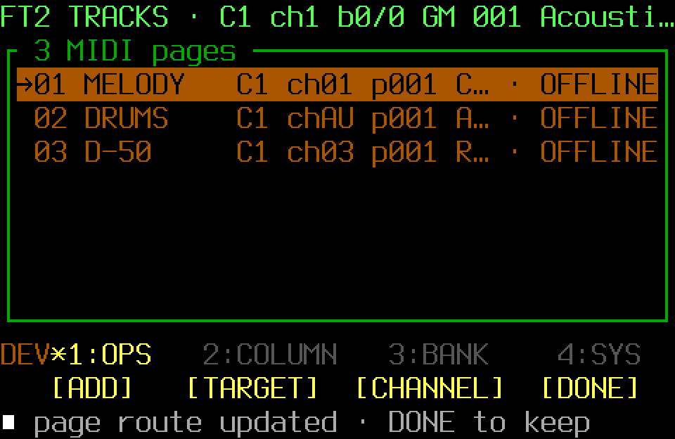

`ADD` adds one four-lane page. `TARGET` opens the destination field. `CHANNEL`
opens the selected column's MIDI channel field. `DONE` validates conflicts and
keeps all page-manager changes. For an external MIDI page, `DONE` also sends
the selected column's bank/program choice immediately for FT2 free play.

### COLUMN — choose column and program

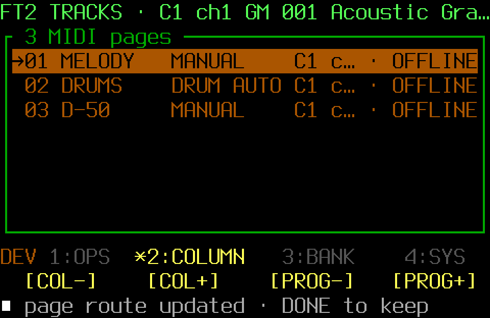

`COL-` and `COL+` select one of the page's four columns. `PROG-` and `PROG+`
choose its 0–127 program, using a device profile's name when available. `DONE`
on OPS sends that selected program as well as keeping it in the Pattern.

### BANK — choose the selected column's bank

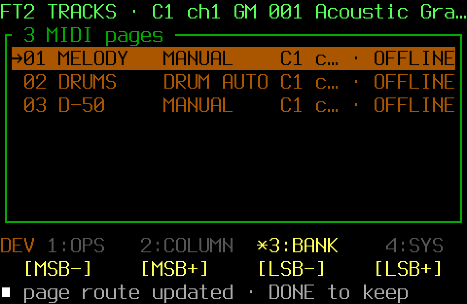

`MSB-`, `MSB+`, `LSB-`, and `LSB+` adjust the MIDI bank-select bytes for the
selected column. The configured bank-select order is honored during playback.

### SYS — safety, help, and cancel

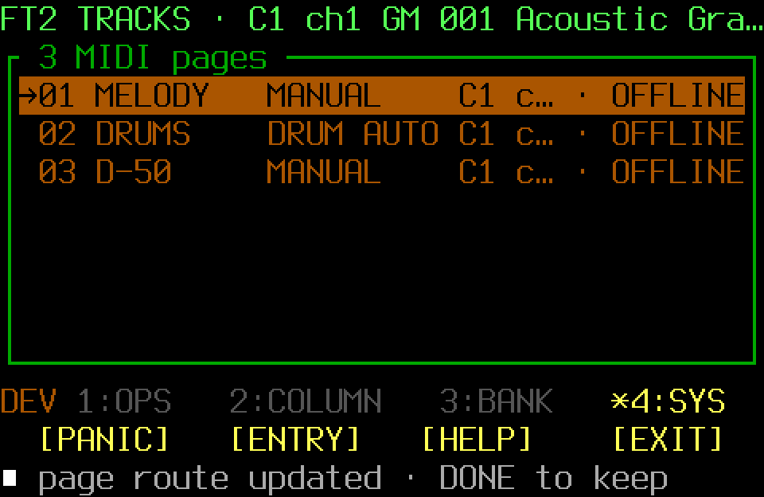

`PANIC` and `HELP` remain available. `ENTRY` opens Manual, One column C1–C4,
and Drum auto choices for the selected page. `EXIT` cancels the entire Tracks
draft and restores the original Project.

## Target field editor

The target field lists discovered synthv1 presets, the configured external
route, and discovered named MIDI outputs. A synth choice belongs to the Pattern,
not the standalone Software Synth workspace. Offline selections are retained in
the Project rather than silently rewritten.

### OPS — confirm destination

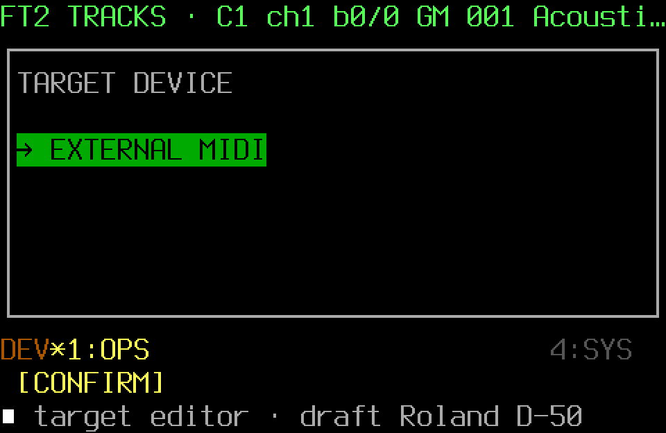

Turn the encoder to choose a device. `CONFIRM` applies the field to the draft
page and returns to Tracks. On eight- and five-button layouts, encoder press is
also confirm.

### SYS — cancel only this field

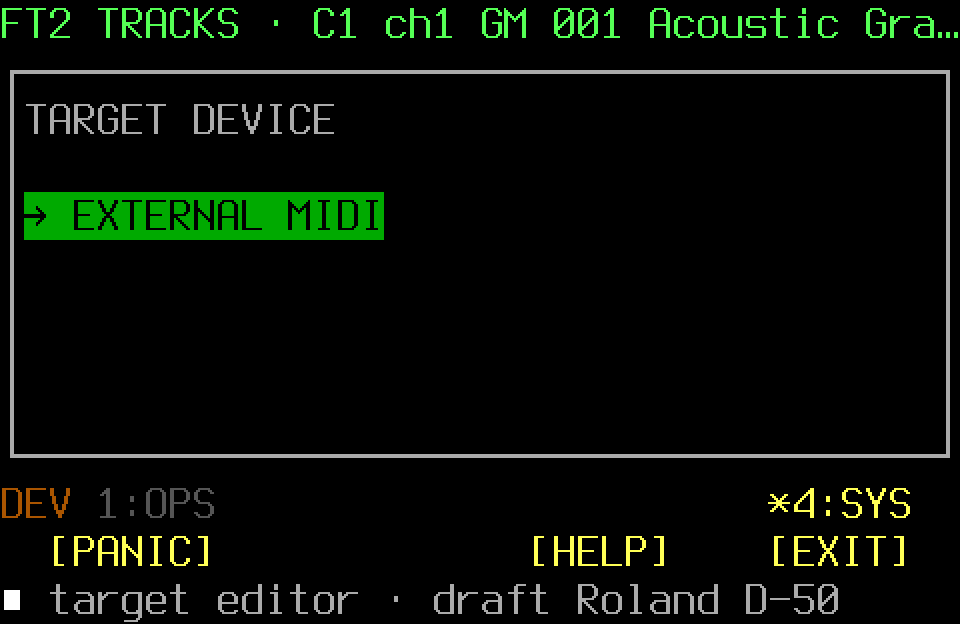

`PANIC` and `HELP` stay available. `EXIT` cancels only the target field and
returns to the unchanged Tracks draft.

## Channel field editor

Channel editing affects only the selected column. The visible value is 1–16;
the persisted MIDI byte remains the standard zero-based 0–15 representation.

### OPS — confirm channel

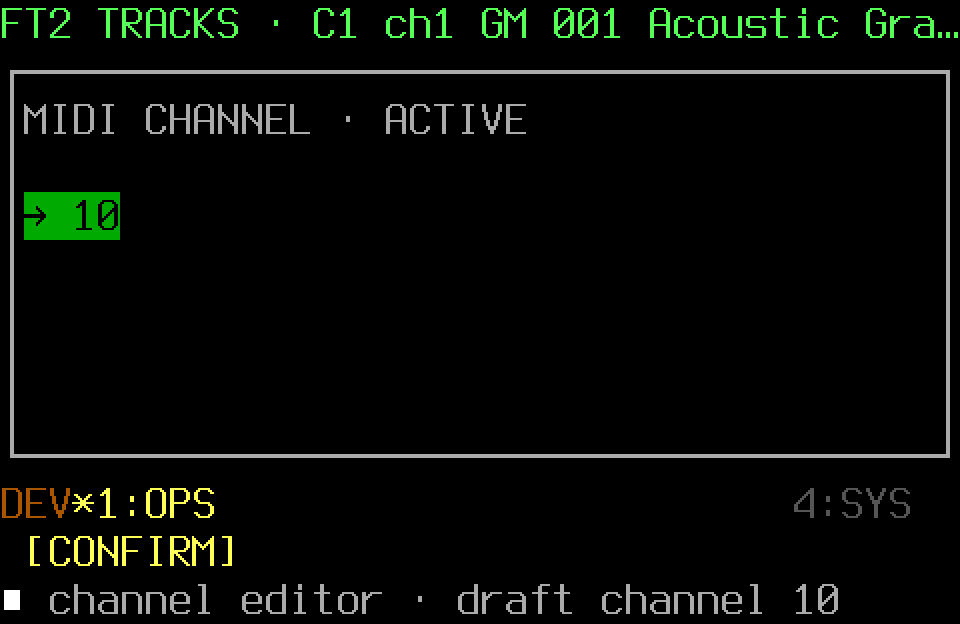

Turn the encoder to choose 1–16. `CONFIRM` applies the field and returns to
Tracks. Encoder press also confirms on eight- and five-button layouts.

### SYS — cancel only this field

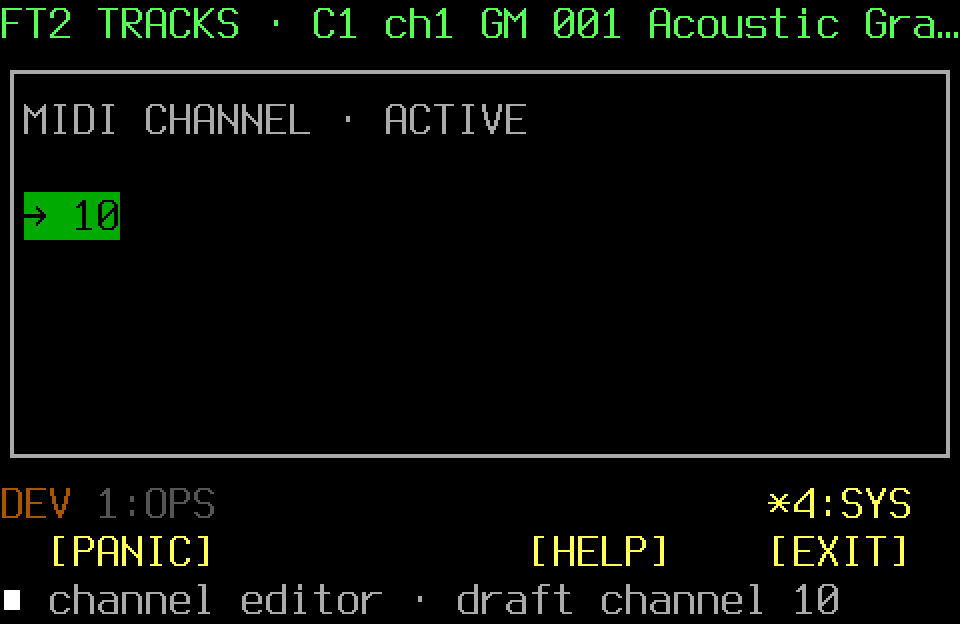

`PANIC` and `HELP` stay available. `EXIT` discards only the channel draft and
returns to Tracks.
